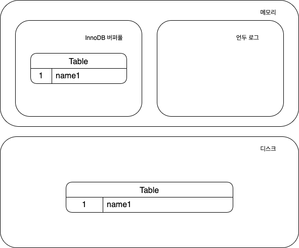
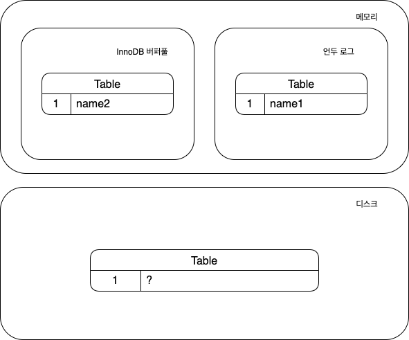

### 1. MVCC(Mutil Version Concurrency Control)
---

- 동시 다발적으로 DBMS에 접근할 때, 데이터의 일관된 읽기를 제공하기 위해서 DBMS에서 일반적으로 사용되는 동시성 제어 방법이다.

### 2. MVCC가 필요한 이유
---

#### 2.1. 데이터가 일관된 읽기를 제공하지 않는다면 어떤 문제가 발생할까?
- 예를 들어 A트랜잭션에서 데이터를 변경하고 커밋이 되기전에, B트랜잭션에서 A트랜잭션의 커밋 전 변경 데이터를 읽어들인다면 실제 반영된 데이터가 아닌데 데이터를 읽어들이는 일관성 문제가 발생할 수 있다.
  1. 계좌에서 돈이 인출되고 목적지에 계좌가 입금 되기 전 (A트랜잭션이 데이터를 변경하고 커밋되기 전)
  2. 계좌 소유자가 해당 계좌 내역을 확인하면 이미 인출된 금액이 표시 (B트랜잭션에서 A트랜잭션이 변경한 데이터를 읽어 들임)

#### 2.2. 비관적 락(Pessimisitic Lock)을 활용한 동시성 제어

> 비관적 락이란 여러 트랜잭션이 데이터를 동시에 수정하는다는 것을 가정하여, 하나의 트랜잭션이 특정 데이터에 접근 하고 있으면 다른 트랜잭션이 접근을 못하도록 막는 동시성 제어 방법이다.

- 위와 같은 문제를 해결하기 위한 가장 간단한 방법은 동시에 접근하는 레코드에 비관적 락을 활용하여 동시성을 제어하는 것이다.
  - 트랜잭션 격리 수준에서 SERIALIZABLE 레벨의 격리 수준을 생각하면 된다.
- 비관적 락을 걸어 간단하게 데이터의 일관성을 유지할 수 있지만 몇가지 문제점이 있다.
  - 많은 트랜잭션이 동일 레코드에 접근하려 할때 동시에 접근할 수 없기 때문에 속도가 저하된다.
  - 하나의 트랜잭션이 데이터 읽기 또는 쓰기의 시간이 오래 걸릴 수록 다른 트랜잭션이 해당 데이터에 접근을 못한다.
- 즉 비관적 락은 데이터 일관성 유지를 위한 방법으로는 좋은 방법이지만 동시 처리 성능이 매우 떨어진다.
  - 동시성 처리 성능이 뛰어나야하는 프로그램의 경우 사용하기 힘든 동시성 제어 방식이다.

### 3. MVCC를 활용하여 데이터 일관성 유지하는 법

- MVCC는 레코드의 변경사항에 대해서 하나의 레코드에 여러 스냅샷 유지한다.
  - 데이터베이스가 데이터를 업데이트할 때 커밋된 경우가 아니라면, 원래 데이터 항목을 바로 덮어쓰지 않고 새로운 버전의 스냅샷을 만든다.
- 데이터베이스에 연결된 각 사용자는 데이터를 읽을 때, 특정 시점의 스냅샷을 바로보게 한다.
  - 즉 커밋되기 전의 데이터(특정 시점의 데이터)를 읽을 수 있는 이유가 여러 버전의 스냅샷이 존재하기 때문이다.
  - MVCC에서 읽기 트랜잭션은 일반적으로 타임스탬프 또는 트랜잭션 ID를 사용하여 읽을 레코드의 버전을 선택하고 읽는다.
- ***하나의 레코드의 변경사항에 대해 다중 버전으로 컨트롤 하고 있기 때문에 비관적 락을 통한 동시성 제어가 필요하지 않다.***
  - 이는 ***동시성 처리 성능이 뛰어나면서 동시에 데이터의 일관성을 유지할 수 있는 동시성 제어 방식***이라는 의미이다.
- MVCC는 버전 정보가 지속적으로 쌓이지 않도록, 더 이상 사용되지 않는 버전의 스냅샷을 제거하는 프로세스가 존재한다.

### 4. MySQL에서의 MVCC

- 해당 레코드의 데이터를 변경하고 커밋되기 전에는 아래와 같은 상태가 된다.
  

1. 언두 로그에 변경 전 데이터가 기록된다.
2. InnoDB 버퍼풀에 변경된 데이터가 기록된다.
3. 디스크도 변경은 되지만 정확한 시점은 알 수 었다.
   - 디스크에서 데이터가 ?라고 표시되어 있는데, InnoDB 버퍼 풀의 내용은 InnoDB 스토리지 엔진의 백그라운드 스레드에 의해서 디스크에 기록되기 때문에 정확히 언제 기록되는지는 알 수 없다.
     -  때문에 백그라운드 스레드에 의해서 변경되어 있을 수도 있고 아직 변경되지 않았을 수도 있다.
     - InnoDB가 ACID를 보장하기 대문에 일반적으로 InnoDB의 버퍼풀과 데이터 파일은 거의 동일한 상태라고 가정해도 무방하다.

- 커밋 이전의 변경된 데이터의 레코드를 조회하게 될때 트랜잭션의 격리 수준에 따라서 어디서 데이터를 반환받을지가 걸정된다.
  - READ_UNCOMMITED
    - 격리 수준이 READ_UNCOMMITED인 경우에는 데이터가 커밋됐든 아니든 변경된 상태의 데이터를 반환한다.
    - 때문에 InnoDB 버퍼 풀이 현재 가지고 있는 변경된 데이터를 읽어서 반환한다.
  - READ_COMMITED이나 그 이상의 격리 수준인 경우
    - 해당 격리 수준에서는 변경된 레코드가 아직 커밋되지 않았기 때문에 언두 영역의 데이터를 반환한다.

> https://en.wikipedia.org/wiki/Multiversion_concurrency_control  
> https://mangkyu.tistory.com/53  