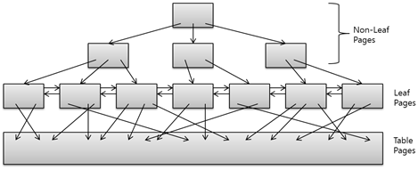
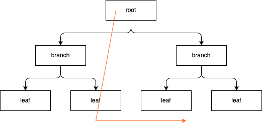
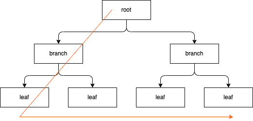

### 1. 인덱스
---

- 데이터베이스 성능이 느린 이유는 디스크 I/O가 발생하기 때문이다.
  - 때문에 최소한의 디스크 I/O를 통해서 데이터를 반환받는 것이 좋다.
  - 즉, 쿼리를 처리하는 데 꼭 필요한 데이터만 읽도록 처리되는 것이 가장 효율적이며 조회 성능을 끌어올릴 수 있는 방법이다.
> 디스크의 성능은 디스크 헤더의 위치 이동 없이 얼마나 많은 데이터를 한 번에 기록하느냐에 의해 결정된다. <br/>데이터를 읽거나 작성할 때, 데이터 헤더의 이동이 많을 수록 속도가 느려진다.
- 인덱스를 이용하면 필요한 데이터를 효율적으로 접근하여, 조회 성능을 끌어올리 수 있다.
  - 그렇기 때문에 데이터베이스의 성능 튜닝은 대부분 인덱스의 튜닝으로 해결할 수 있다.
- 테이블에서 내가 원하는 데이터를 효율적으로 가져오기 위하여 인덱스는 컬럼의 값(키), 해당 레코드가 저장된 주소(값)를 저장하고 이를 통해서 조회 성능을 올려줄 수 있다.

### 1.1. B-Tree 인덱스의 구조



- 루트 노드(Root Node): 최상위 노드이며 B-Tree의 진입점 역할을 한다.
- 브랜치 노드 (Branch Node): 루트 노드와 리프 노드 사이에 위한 노드들이다. 하위 노드를 찾기위한 역할을 한다.
  - 루트 노드와 브랜치 노드는 하위 노드에 대한 대한 주소값을 가지며, 키값은 하위 노드에 저장된 키값의 범위를 나타낸다.
- 리프 노드 (Leaf Node): 가장 하위에 있는 노드이며, 실제 데이터나 실제 데이터를 찾기 위한 주소값을 가지고 있다. 실제 데이터를 찾기위한 역할을 한다.
  - 리프 노드는 다른 노드들과 다르게 양방향 연결 리스트 구조이다.

### 1.2. B-Tree 인덱스의 특징
1. 정렬된 구조
- B-Tree 인덱스를 통해서 조회할 때 최대한 빠르게 찾을 수 있도록 컬럼들의 값을 주어진 순서로 미리 정렬해서 보관하고 있다.
- 정렬된 구조를 유지하기 위해서 레코드를 쓰는 과정이 복잡하고 느리지만, 이미 정렬되어 있어서 빠르게 레코드를 찾을 수 있다. 
  - 인덱스가 많은 테이블의 경우에 `INSERT, UPDATE, DELETE`문장의 처리가 느려진다.
  - `SELECT` 쿼리에 `WHERE`문에 걸리는 컬럼이라고 해서 무작정 인덱스를 걸지 말아야하는 이유이다. (인덱스 설계의 중요성)
2. 범위 스캔(range scan) 가능
   - 인덱스가 조회 성능을 올리는 가장 큰 이유중 하나가 바로 범위 스캔이다. 
   - 앞서 B-Tree 인덱스는 정렬된 구조를 유지하고 있다고 했다.
   - 이말은 어디서부터 어디까지 읽을 수 있을 지를 알 수 있다는 의미이기도 하다.
     - 1부터 10까지 중복되지만 정렬되지 않은 리스트가 있으면, 5를 찾기 위하여 처음부터 끝까지 읽어들여할 것이다.
     - 하지만 해당 리스트가 정렬되어 있다면 어디서 부터 어디까지 읽어야하는지를 알 수 있다. 
3. 테이블 디스크 공간보다 작은 디스크 공간
   - 인덱스 ***컬럼의 값과 해당 레코드가 저장된 주소를 키와 값을 쌍으로 삼아 인덱스를 저장***하기 때문에, 태이블을 저장하는 데 필요한 디스크 공간보다 작다.


### 1.3. B-Tree 인덱스의 장점
- 정렬된 구조이기 때문에 B-Tree 인덱스를 이용하면 일부만 읽고 멈출 수 있다.
  - 즉, 정렬된 구조 덕분에 범위 스캔(Range Scan)이 가능하다.
- 범위 스캔이 가능하기 때문에 동등(=) 및 범위(<, >, <=, >=, BETWEEN) 검색에 최적화 되어 있다.
  - 리프 노드가 양방향 연결 리스트 구조를 가지기 때문에 범위 검색 시 다시 루트 노드 부터 조회할 필요가 없다. 
- B-Tree는 한쪽 방향으로 쏠리지 않게 트리의 균형이 유지되기 때문에 최악의 경우에도 로그 시간 복잡도(O(log N))로 데이터를 찾을 수 있다.


### 1.4. B-Tree 인덱스의 단점

- 트리가 한쪽으로 쏠리지 않게 균형을 유지하고 정렬을 유지하기 위하여, 데이터를 쓰거나 삭제하는 작업에서 B-Tree 구조가 재구성되어 느리다.
- 인덱스를 잘못 사용할 경우 오히려 검색 속도가 느려질 수 있다.
  - 데이터를 읽어들일 때 인덱스를 사용하는 것이 무조건적으로 성능을 올리 수 있다고 생각할 수 있지만, 이 것은 사실이 아니다.
  - 인덱스를 통해서 검색을 한다는 것은 루트 -> 브랜치 -> 리프 -> 디스크라는 과정을 거치게 됨으로 인해서 실제로는 그렇게 효율적인 검색 방식이 아니다.
  - 많은 데이터를 인덱스를 통해서 처리하는 것이 아닌, 소량의 데이터를 가지고 올 때 인덱스의 효과가 발휘가 된다. 때문에 인덱스 설계는 중요하다.   

### 1.5. 인덱스 분류하기


#### 1.5.1. 인덱스 역할별로 분류
<table>
  <tr>
    <td>프라이머리 키 (Primary Key)</td>
    <td>
    이 인덱스를 가진 컬럼은 테이블에서 해당 레코드를 식별하는 기준값이 된다. <br/>프라이머리 키는 NULL 값을 허용하지 않으며 중복을 허용하지 않는다.
    </td>
  </tr>
  <tr>
    <td>보조 키 (Secondary Key)</td>
    <td>
    프라이머리 키를 제외한 나머지 모든 인덱스를 보조키로 분류된다.
    </td>
  </tr>
</table>


#### 1.5.2. 데이터 중복 허용 여부로 분류

<table>
  <tr>
    <td>유니크 인덱스 (Unique Index)</td>
    <td>
    인덱스 컬럼의 값을 중복 허용하지 않는다.
    </td>
  </tr>
  <tr>
    <td>유니크 하지 않은 인덱스 (Non-Unique Index)</td>
    <td>
    컬럼의 값의 중복을 허용한다.
    </td>
  </tr>
</table>

#### 1.5.3. 인덱스 정렬과 테이블 레코드 정렬이 같은지 여부

<table>
  <tr>
    <td>클러스터 인덱스 (Clustered Index)</td>
    <td>
    인덱스 값의 정렬 기준으로 테이블 레코드가 정렬되어 있는 경우이다.
    </td>
  </tr>
  <tr>
    <td>유니크 하지 않은 인덱스 (Non-Clustered Index)</td>
    <td>
    인덱스 값의 정렬 기준과 테이블 레코드 정렬 기준이 같지 않는 경우이다.
    </td>
  </tr>
</table>


### 1.6. MySQL InnoDB 스토리지 엔진에서 인덱스의 특징
- 다른 스토리지 엔지의 경우에는 리프 노드에 실제 데이터 레코드의 주소 값을 가지고 있다.
- InnoDB 스토리지 엔진에서는 보조 키 리프 노드가 프라이머리 키 값의 주소를 가지고 있으며, 해당 프라이머리 키값을 이용하여 실제 레코드 주소를 찾아가는 방식을 사용하고 있다.
  - 즉, 데이터 레코드를 읽기 위해서는 반드시 프라이머리 키 값을 저장하고 있는 B-Tree를 다시 검색해야 한다. 


### 2. B-Tree 인덱스 추가 및 삭제
---

### 2.1. 인덱스 키 추가

- 인덱스 키 값을 추가하기 위해서는 해당 값을 저장하기위한 적절한 위치를 찾아야 한다. (정렬순서를 지키기 위해서)
- 저장될 위치를 찾게되면 키 값과 주소 정보를 B-Tree의 리프 노드에 저장하게 되는데, 리프 노드가 꽉 차서 더이상 저장할 수 없을 경우에는 리프노드가 분리되며, 이는 상위 브랜치 노드까지 처리의 범위가 넓어질 수 있다.
  - 이러한 작업 때문에 B-Tree는 상대적으로 쓰기 작업에 비용이 많이 든다. 
- 해당 작업 비용이 많이 들기 때문에 인덱스 키 추가 작업을 지연시켜 나중에 처리할 수 있다. 
  - 프라이머리 키나 유니크 인덱스의 경우 중복 체크가 필요하기 때문에 B-Tree에 추가하거나 삭제한다. 

### 2.2. 인덱스 키 삭제

- 레코드를 사젝하게 될 경우, 키 값이 저장된 B-Tree의 리프 노드를 찾아서 삭제 마크만 하면 작업이 완료된다.
- 삭제 마킹된 인덱스 키 공간은 그대로 방치하거나 재활용할 수 있다.
- 삭제 마킹은 디스크 I/O가 필요한 작업이며, InnoDB 스토리지 엔진에서는 이 작업이 버퍼링되어 지연 처리될 수도 있다.

### 2.3. 인덱스 키 수정
- B-Tree 인덱스 키 값은 값에 따라서 저장될 리프 노드의 위치(정렬되어 있음)가 결정되기 때문에, 단순히 인덱스상의 키 값만 변경하는 것은 불가능하다.
- 때문에 해당 키값을 삭제한 후, 다시 새로운 키 값을 추가하는 작업을 진행한다.
- 인덱스 키 추가 작업과 삭제 작업을 하기 때문에 InnoDB 스토리지 엔진에서는 수정 작업도 버퍼링되어 지연처리 될 수도 있다.


### 3. 인덱스 스캔
---

### 3.1. 인덱스 레인지 스캔 (Index Range Scan)


- 인덱스 레인지 스캔은 인덱스 루트에서 리프 블록까지 수직적 탐색 이후, 필요한 범위만큼 스캔한다.

- 인덱스 자체의 정렬 특성 때문에 인덱스를 구성하는 컬럼의 정순 또는 역순으로 정렬된 상태로 레코드를 가져온다.
  - InnoDB 스토리지 엔진에서는 세컨더리 인덱스의 리프노드가 프라이머리 키 값을 가지고 있기 때문에 ORDER BY 절을 사용하지 않을 경우, 프라이머리 키값으로 정렬된 레코드를 가져온다.
- 인덱스 리프 노드에서 데이터를 가져올 때, 레코드 수만큼 랜덤 I/O가 발생하기 때문에 인덱스 스캔의 범위를 너무 크게 잡으면 성능상 좋지 않다.
> 인덱스를 통해서 읽어야 할 데이터 레코드가 20~25%를 넘으면 인덱스를 통한 읽기보다 테이블의 데이터를 직접 읽는 것이 더 효율적인 처리 방식이 된다.

- 커버링 인덱스
- 특정 쿼리에 따라서 레코드에 직접접근 하지 않고 인덱스를 통해서 결과를 반환할 수 있는데 이를 커버링 인덱스라 한다.
- 커버링 인덱스로 처리되는 쿼리는 디스크의 레코드를 읽지 않아도 되기 때문에 랜덤 I/O가 줄어들고 성능도 그만큼 빨라진다.
  - 예를 들어서 인덱스 컬럼의 최솟값, 최대값을 반환하는 코드가 될 수 있다.


### 3.2. 인덱스 풀 스캔 (Index Full Scan)


- 인덱스 레인지 스캔과는 달리 인덱스의 처음부터 끝까지 모두 읽는 방식을 인덱스 풀 스캔이라고 한다.
- 인덱스를 전체 스캔하는 단계에서 대부분의 레코드를 필터링하고 아주 일부분의 레코드만 테이블을 엑세스 하는 상황이라면 옵티마이저는 인덱스 풀 스캔 방식을 선택한다.
  - 인덱스가 테이블보다 크기가 작기 때문에 옵티마이저가 인덱스 풀 스캔이라는 방식을 선택하는 이유가 된다.
- 인덱스 풀 스캔은 인덱스를 통해서 레코드를 읽어들이기 때문에, 테이블 풀 스캔보다는 효율적이지만 적절한 인덱스가 없어서 차선책으로 선택한 방식이다.
  - 때문에 인덱스 풀 스캔이 자주일어난다면 인덱스 튜닝을 통해서 인덱스 레인지 스캔으로 변경해주는 것이 좋다.

#### 3.2.1. 인덱스 풀 스캔이 발생하는 경우
- 대부분의 레코드를 필터링하고 아주 일부분의 레코드만 테이블을 엑세스 하는 상황이라면 옵티마이저는 인덱스 풀 스캔 방식을 선택한다고했는데 어떤 경우에 주로 발생할까?
- 주로 다중 컬럼 인덱스가 걸려 있을 때 선두 컬럼을 활용하지 않는 경우 발생한다.
```sql
create table index_full_scan (
    name varchar(20) not null,
    age int not null
);

create index name_age_idx on index_full_scan(name, age);

insert into index_full_scan(name, age) value ('name1', 1);
insert into index_full_scan(name, age) value ('name2', 2);

-- 선두 컬럼(name)을 활용하지 않고, age 컬럼을 통해서 조회하고 있다.   
select * from index_full_scan where age > 1;
```
- 만약 해당 조회문의 수행빈도가 높고 인덱스의 크기가 크다면, age 컬럼을 인덱스로 따로 생성하는 것이 좋다.


### 3.3. 인덱스 스킵 스캔 (Index Skip Scan)

- 조건절에 선두 컬럼을 활용하지 후행 컬럼을 통해서 조회하여 일부 레코드를 가지고 올 때 옵티마이저는 인덱스 풀 스캔방식을 활용한다.
- 

### 3.3. 루스 인덱스 스캔

  - 루스 인덱스 스캔은 말 그대로 느슨하게 또는 듬성듬성하게 인덱스를 읽는 것을 의미한다.
  - 인덱스 레인지 스캔과 비슷하게 작동하지만 중간에 필요치 않은 인덱스 키 값은 무시하고 다음으로 넘어가는 형태로 처리한다.
  - GROUP BY 또는 집합 함수 가운데 MAX() 또는 MIN() 함수에 대해 최적화를 하는 경우 사용된다.
```sql
-- dept_no, emp_no 두 개의 컬럼이 인덱스가 걸려 있을 때
select dept_no, min(emp_no)
from dept_emp
where dept_no between 'd002' and 'd004'
group by dept_no;
```
- 인덱스내에서 `dept_no asc, emp_no asc` 조합으로 정렬되어 있을 것이다.
- dept_no를 그룹 별로 첫 번째 레코드의 emp_no 값만 읽으면 된다.
- 즉, where 조건에 만족하는 범위 전체의 인덱스를 스캔할 필요가 없다.
- 위의 예시를 통해서 풀이하자면 인덱스 리프 노드를 스캔하면서 불필요한 부분은 그냥 무시하고 필요한 부분만 읽는 루프 인덱스 스캔을 사용하였다.

### 3.4. 인덱스 스킵 스캔
- 기본적으로 다중 컬럼에 인덱스가 걸려 있을 경우 첫 번째 인덱스를 검색하지 않고 나머지 컬럼을 통해서 검색할 경우 인덱스를 효율적으로 사용할 수 없다.
```sql
-- gender, birth_date 순으로 두개의 컬럼이 인덱스가 걸려있는 경우

-- 인덱스를 효율적으로 사용하지 못하는 쿼리
select * from member where birth_date >= '1965-02-01';

-- 인덱스를 사용하는 쿼리
select * from member where gender='M' birth_date = '1965-02-01';
``` 

- MySQL 8.0 버전 부터는 첫 번째 컬럼을 건너 뛰고, 나머지 컬럼만으로 인덱스 검색이 가능하게 해주는 인덱스 스킵 스캔 최적화 기능이 도입되었다.
- 
```sql
-- 사용자가 길행한 검색 쿼리
select gender, birth_date from member where birth_date >= '1965-02-01';

-- 옵티마이저가 인덱스 스킵 스캔을 이용해 실행해주는 쿼리
select gender, birth_date from member where gender='M' and birth_date >= '1965-02-01';
select gender, birth_date from member where gender='F' and birth_date >= '1965-02-01';
```
- 단점은 존재한다.
  - WHERE 조건절에 조건이 없는 인덱스의 선행 컬럼의 유니크한 값의 개수가 적어야 함
  - 쿼리가 인덱스에 존재하는 컬럼만으로 처리 가능해야하 함 (커버링 인덱스)

### 다중 컬럼 인덱스
- 실무에서는 하나의 컬럼에만 인덱스를 걸지 않고, 여러 컬럼에 인덱스를 거는 경우가 있다.
- 다중 컬럼에 인덱스를 만들게 될경우 두 번째 컬럼이 첫 번째 컬럼에 의존해서 정렬되어 있다는 것이다.
- 어떻게 걸어야할지 모르겠다면 카디널리티가 낮은 컬럼에서 높은순으로 다중 컬럼 인덱스를 만드는 것이 좋다.
  - 성별과 나이 컬럼을 이용해 인덱스를 걸 경우, 성별을 첫번째, 나이를 두번째 


- B-Tree 인덱스를 통한 데이터 읽기
  - 인덱스 레인지 스켄
    - 인덱스 레인지 스캔은 겁색해야 할 인덱스의 범위가 결정됐을 때 사용하는 방식이다.
    - 검색하려는 값의 수나 겁색 결과 레코드 건수와 관계없이 레인지 스캔이라고 표현한다.
    - B-Tree의 노드들을 거쳐 리프 노드의 읽기 시작해야할 위치를 찾으면 찾아야할 마지막 값까지 순서대로 읽기 시작한다.
    - 하지만 B-Tree 인덱스의 리프 노드를 스캔하면서 실제 데이터 파일의 레코드를 읽어야 하는 경우도 많다.
      - 인덱스의 정렬 순서대로 레코드를 가져온다.
      - 리프 노드에 검색 조건에 일치하는 건들은 데이터 파일에서 레코드를 읽어오는 과정이 필요하다.
        - 레코드 주소로 데이터 파일의 레코드를 읽어오는데 레코드 한 건 한 건 단위로 랜덤 I/O 가 발생한다.
        - 인덱스를 통해서 3건의 레코드 검색 조건에 일치한다면 최대 3번의 랜덤 I/O가 발생한다.
        - 때문에 인덱스를 통해 레코드를 읽는 작업은 비용이 많이 드는 작업이므로 읽어야할 데이터 레코드가 20~25%가 넘으면 인덱스를 통한 읽기 보다 테이블의 데이터를 직접 읽는 것이 더 효율적인 처리 방식이 된다.
    - 인덱스 레인지 스캔의 과정
      - 인덱스에서 조건을 만족하는 값이 저장된 위치를 찾는다. 이 과정을 인덱스 탐색이라고 한다.
      - 탐색된 위치부터 필요한 만큼 인덱스를 차례대로 쭉 읽는다. 이 과정을 인덱스 스캔이라고 한다.
      - 읽어들인 인덱스 키와 레코드를 주소를 이용해 레코드가 저장된 페이지를 가져오고, 최종 레코드를 읽어온다.
    - 커버링 인덱스
      - 쿼리가 필요로 하는 데이터에 따라 레코드가 저장된 페이지를 가져와, 최종 레코드를 읽는 작업을 하지 않는 경우가 있다. 이를 커버링 인덱스라고 한다.
    - `SHOW STATUS LIKE 'Handler_%'`
      - Handler_read_first, Handler_read_last는 인덱스 값의 최소값 또는 최대값을을 읽을 때 증가하는 상태값이다.
      - 이 상태 값들은 읽은 레코드의 건수를 의미하는데, 실제 인덱스만 읽어는지 인덱스를 통해 테이블의 레코드를 읽어는지는 구분하지 않는다.

- 인덱스 풀 스캔
  - ***인덱스의 처음부터 끝까지 모두 읽는 방식을 인덱스 풀 스캔***이고 한다.
    - 인덱스 레인지 스캔과 마찬가지로 인덱스를 사용한다.
  - 쿼리가 인덱스에 명시된 컬럼만으로 조건을 처리할 수 있는 경우 주로 사용한다.
    - 대표적으로 쿼리의 조건절에 사용된 컬럼이 인덱스의 첫 번째 컬럼이 아닌 경우 인덱스 풀 스캔 방식이 사용된다.
  - 이 방식은 레인지 스캔보다 빠르지 않지만, 테이블 풀 스캔보다는 효율적이다.
    - 테이블 레코드를 직접 읽을 필요가 없기 때문에 적은 디스크 I/O로 쿼리를 처리할 수 있다.
    - 일반적으로 인덱스의 크기가 테이블 자체의 크기보다는 작기 때문에 테이블 풀 스캔보다는 효율적이다.
  - 테이블 풀 스캔보다는 효율적이기는 하지만, 인덱스를 효율적으로 사용한다라고는 장담하지 못한다.

- 루스 인덱스 스캔
  - 루스 인덱스 스캔은 말 그대로 느슨하게 또는 듬성듬성하게 인덱스를 읽는 것을 의미한다.
  - 인덱스 레인지 스캔과 비슷하게 작동하지만 중간에 필요치 않은 인덱스 키 값은 무시하고 다음으로 넘어가는 형태로 처리한다.
  - GROUP BY 또는 집합 함수 가운데 MAX() 또는 MINI() 함수에 대해 최적화를 하는 경우 사용된다.
```sql
-- dept_no, emp_no 두 개의 컬럼이 인덱스가 걸려 있을 때
select dept_no, min(emp_no)
from dept_emp
where dept_no between 'd002' and 'd004'
group by dept_no;
```
- 인덱스내에서 `dept_no asc, emp_no asc` 조합으로 정렬되어 있을 것이다.
- dept_no를 그룹 별로 첫 번째 레코드의 emp_no 값만 읽으면 된다.
- 즉, where 조건에 만족하는 범위 전체의 인덱스를 스캔할 필요가 없다.
- 위의 예시를 통해서 풀이하자면 인덱스 리프 노드를 스캔하면서 불필요한 부분은 그냥 무시하고 필요한 부분만 읽는 루프 인덱스 스캔을 사용하였다.

- 인덱스 스킵 스캔
- 기본적으로 다중 컬럼에 인덱스가 걸려 있을 경우 첫 번째 인덱스를 검색하지 않고 나머지 컬럼을 통해서 검색할 경우 인덱스를 효율적으로 사용할 수 없다.
```sql
-- gender, birth_date 순으로 두개의 컬럼이 인덱스가 걸려있는 경우

-- 인덱스를 효율적으로 사용하지 못하는 쿼리
select * from member where birth_date >= '1965-02-01';

-- 인덱스를 사용하는 쿼리
select * from member where gender='M' birth_date = '1965-02-01';
``` 

- MySQL 8.0 버전 부터는 첫 번째 컬럼을 건너 뛰고, 나머지 컬럼만으로 인덱스 검색이 가능하게 해주는 인덱스 스킵 스캔 최적화 기능이 도입되었다.
- 
```sql
-- 사용자가 길행한 검색 쿼리
select gender, birth_date from member where birth_date >= '1965-02-01';

-- 옵티마이저가 인덱스 스킵 스캔을 이용해 실행해주는 쿼리
select gender, birth_date from member where gender='M' and birth_date >= '1965-02-01';
select gender, birth_date from member where gender='F' and birth_date >= '1965-02-01';
```
- 단점은 존재한다.
  - WHERE 조건절에 조건이 없는 인덱스의 선행 컬럼의 유니크한 값의 개수가 적어야 함
  - 쿼리가 인덱스에 존재하는 컬럼만으로 처리 가능해야하 함 (커버링 인덱스)


### 다중 컬럼 인덱스
---

- 실제 서비스용 데이터베이스에서는 2개 이상의 컬럼을 포함하는 인덱스가 많이 나온다.
- 중요한 것은 두 번째 컬럼 부터는 앞의 컬럼에 의존해서 정렬되어 있다는 것이다.
- 따라서 다중 컬럼 인덱스에서는 인덱스 내에서 각 컬럼의 위치가 상당히 중요하다.

### B-Tree 인덱스의 정렬 및 스캔 방향

---

- 인덱스의 키 값은 항상 오름차순이거나 내림차순으로 정렬된다.
- 하나의 순서로 정렬되어 있다고 해서 그 순서로만 인덱스를 읽을 수 있다는 의미는 아니다.
- 거꾸로 끝에서 부터 읽으면 오름차순으로 정렬된 인덱스도 내림차순으로 읽을 수 있다.
  - Double Linked List 구조를 떠올려 보자

- 인덱스의 정렬 
  - 인덱스의 구성하는 각 컬럼의 정렬은 오름차순 또는 내림차순으로 설정할 수 있다.
  - 컬럼 단위로 정렬 순서를 사용할 수 있기 때문에 다중 컬럼 인덱스에서도 정렬을 혼합하여 사용할 수 있다.
    ```sql
    -- 다중 컬럼 인덱스 생성
    create index ix_teamname_username on member (team_name asc, user_name desc)
    ```

- 인덱스의 스캔 방향 
  - 하나의 컬럼에 오름차순으로 생성된 인덱스를 `max`나 `order by desc` 절을 통해서 값을 가져올 때, 인덱스의 처음부터 끝까지 읽어서 값을 가져올까?
    ```sql
    -- 오름차순으로 username 인덱스 생성
    create index ix_username on member (username asc)

    select max(username) from member;
    select * from member order by username desc limit 1;
    ```  
    - 옵티마이저는 내가 사용한 쿼리를 해석하여 인덱스를 거꾸로 읽으면 최단 시간에 값을 가져온다는 것을 이미 알고 있다.
    - 때문에 옵티마이저가 읽기 방향을 전환해서 사용하도록 실행 계획을 만들어낸다.
  - 오름차순으로 생성된 인덱스를 정순으로 읽으면 오름차순으로 정렬된 결과가 나오고, 역순으로 읽으면 내림차순으로 정렬된 상태가 된다.
- 내가 어떤 정렬순으로 인덱스를 생성해였다고 하더라도 역순으로도 인덱스를 스캔할 수 있다는 것이다.


- 인덱스 내림차순


### B-Tree 인덱스의 가용성과 효율성

- 쿼리를 작성할 때 어떤 경우에 인덱스를 사용할 수 있고 어떤 경우에 인덱스를 사용하지 않는지 식별할 수 있어야한다.
- 그래야만 쿼리의 조건을 최적화하거나, 쿼리에 맞게 인덱스를 최적으로 생성할 수 있다.

- 인덱스의 효율성

- 비교 조건의 종류와 효율성
- 인덱스의 특징은 왼쪽 값에 기준해서 오름쪽 값이 정렬되어 있다는 것이다.
  - 예를 들어 하나의 컬럼에 B1234, A1234라는 값이 있을 경우 A1234, B1234 순으로 인덱스가 정렬되어 있을 것이다.
- 따라서 왼쪽 값을 모르면 인덱스의 효과를 얻을 수 없다.
```sql
-- username을 통해서 인덱스 생성
create index ix_username on member (username)

-- 왼쪽 값을 모르기 때문에 인덱스 활용 불가
select * from member where username LIKE '%user'
select * from member where username LIKE '%user%'

-- 왼쪽 값을 알기 때문에 인덱스 활용 가능
select * from member where username LIKE 'user%'

```

- 위와 같이 인덱스를 생성하였지만 인덱스를 제대로 활용 못하는 경우들이 몇가지 있다.


### 클러스터링 인덱스
- 클러스터링 인덱스는 테이블의 프라이머리 키에 대해서만 적용되는 내용이다.
```sql
create table table_name (
    id bigint not null auto_increment,
    column_name varchar(20) not null
    primary key(id)
)

-- 해당 테이블 생성 이후 insert문을 통해 데이터를 삽입하면 id 컬럼 오름차순 기준으로 레코드가 정렬되어 있다.
-- 즉 테이블의 레코드가 프라이머리 키 값으로 정렬되어 있다. 이러한 경우에 클러스터링 인덱스라고 한다.
-- 인덱스의 정렬 순서와 테이블의 정렬 순서가 같은 경우 클러스터링 인덱스라고 부른다.
```

  - 중요한 것은 프라이머리 키 값에 의해 레코드의 저장 위치가 결정된다는 것이다.
  - 프라이머리 키 값으로 클러스터링 된 테이블은 프라이머리 키 값 자체에 대한 의존도가 상당히 높다.
  - 클러스터링 인덱스로 저장되는 테이블은 프라이머리 키 기반의 검색이 매우 빠르며, 대신 레코드의 저장이나 프라이머리 키의 변경이 상대적으로 느리다.
- 테이블의 레코드가 프라이머리 키 값으로 정렬되어 저장된 경우만 `클러스터링 인덱스` 또는 `클러스터링 테이블`이라고 부른다.
- B-Tree 인덱스도 인덱스 키 값으로 이미 정렬은 되어 있지만 테이블의 레코드 순서가 해당 인덱스로 정려되어 있지는 않기 때문에 클러스터링 인덱스라고 부르지 않는다.
- 프라이머리 키가 없는 InnoDB 테이블은 어떻게 클러스터링 테이블로 구성될까?
1. 프라이머리 키가 있으면 기본적으로 프라이머리 키를 클러스터링 키로 선택한다.
2. NOT NULL 옵션의 유니크 인덱스 중에서 첫 번째 인덱스를 클러스터링 키로 선택한다.
3. 자동으로 유니크한 값을 가지도록 증가되는 컬럼을 내부적으로 추가한후 클러스터링 키로 선택한다.
- 적절한 클러스터링 키 후보를 찾지 못하는 경우 InnoDB 스토리지 엔진이 내부적으로 레코드의 일렬번호 컬럼을 생성한다.
  - 사용자에게 노출되지 않으며, 쿼리문장에 명시적으로 사용할 수 없다.
  - 때문에 자동으로 생성된 클러스터링 키는 아무런 혜택을 줄 수 없다.
- 테이블에서 클러스터링 인덱스느 테이블당 단 하나만 가질 수 있는 엄청난 혜택이므로 가능하다면 프라이머리 키를 명시하는 것이 좋다.

### 프라이머리 키가 세컨더리 인덱스에 미치는 영향

- 기본적으로 인덱스를 통해서 레코드 주소(ROWID)를 가져와 레코드를 찾는 역할을 한다.
- 그렇다면 InnoDB에서 클러스터링 인덱스가 아닌 세컨더리 인덱스가 실제 레코드 주소를 가지오 있다면 어떻게 될까?
  - 클러스터링 키 값이 변경될 때마다 데이터 해당 레코드 주소를 가진 인덱스의 주소 값을 변경해야 할 것이다.
  - 이러한 오버헤드를 제거하기 위해서 InnoDB 테이블은 모든 세컨더리 인덱스는 해당 레코드에 저장된 주소가 아니라 프라이머리 키값에 저장되도록 구현되어 있다.
- 때문에 세컨더리 인덱스를 통해서 조회하는 과정
  - 세컨더리 인덱스를 통해서 검색
  - 프라이머리 키 값을 확인 이후 프라이머리 키 인덱스 검색
  - 최종 레코드 가져옴

### 클러스터링 인덱스의 장점과 단점

- 장점
  - 프라이머리 키로 검색할 때 처리 성능이 매우 빠름
  - 테이블의 모든 세컨더리 인덱스가 프라이머리 키를 가지고 있기 때문에 인덱스만으로 처리될 수 있는 경우가 많음
- 단점
  - 테이블의 모든 세컨더리 인덱스가 클러스터링 키를 갖고 있기 때문에 클러스터링 키 값의 크기가 클 경우 전체적으로 인덱스의 크기가 커짐
  - 세컨더리 인덱스를 통해 검색할 때 프라이머리 키를 다시 한번 검색함으로 인해서 처리 성능이 느림
  - INSERT할 때 프라이머리 키에 의해 레코드의 저장 위치가 결정되기 때문에 처리 성능이 느림
  - 프라이머리 키를 변경할 때 레코드를 DELETE하고 INSERT하는 작업이 필요하기 때문에 처리 성능이 느림


### 클러스터링 테이블 사용 시 주의사항

1. 클러스터링 인덱스 키의 크기
   - 모든 세컨더리 인덱스가 프라이머리 키 값을 포함하기 때문에 프라이머리 키 값이 커지면 세컨더리 인덱스도 자동으로 크기가 커진다.
   - 5개의 세컨더리 인덱스를 가지는 테이블의 프라이머리 키가 10바이트인 경우 인덱스 크기 증가 확인해보기
     - 1건의 레코드 삽입으로 인해서 증가하는 인덱스 크기 `10바이트 * 5 (인덱스 개수) * 1(레코드 수) = 50바이트`
   - 프라이머리 키값이 크면 레코드가 증가할 수록 인덱스 크기도 기하 급수적으로 커진다.
   - 인덱스가 커질수록 같은 성능을 내기 위해 그만큼의 메모리가 더 필요해지므로 InnoDB 테이블의 프라이머리 키는 신중하게 선택해야한다.
2. 프라이머리 키는 AUTO_INCREMENT 보다는 업무적인 컬럼으로 생성 (가능한 경우)
   - InnoDB의 프라이머리 키는 클러스터링 키로 사용되므고, 이 값에 의해 헤코드의 위치가 결정된다.
   - 프라이머리 키로 검색하는 경우 클러스터링되지 않은 테이블에 비해 매우 빠르게 처리될 수 있음을 의미한다.
   - 때문에 AUTO_INCREMENT된 컬럼으로 검색이 잦지 않을 경우에는 할 경우 오히려 성능이 떨어진다고 생각된다면 업무적인 컬럼을 생성하여 해당 컬럼을 프라이머리 키로 설정하는 것이 좋다.
     - 예를 들자면 주문 번호를 통해서 검색하는 경우가 있을 것이다.
3. 프라이머리 키는 반드시 명시할 것
   - InnoDB테이블에 프라이머리 키를 정의하지 않으면 InnoDB 스토리지 엔진이 내부적으로 일렬번호 컬럼을 추가한다.
   - 자동으로 추가된 클러스터링 인덱스는 사용자거 접근할 수가 없다.
   - 이말은 프라이머리 키를 정의하지 않은 경우와 AUTO_INCREMENT 컬럼을 생성하고 프라이머리 키로 설정하는 것이 결국 같다는 의미이다.
   - 때문에 사용자가 사용할 수 있는 값을 프라이머리 키로 설정하는 것이 좋다.
   - ROW 기반의 복제난 InnoDB Cluster에서는 모든 테이블이 프라이머리 키를 가져야만 복제 성능을 보장하므로 프라이머리 키는 꼭 생성하자.

### 유니크 인덱스
---

- 유니크 인덱스는 제약 조건이 존재하는 인덱스이다.
  - 테이블이나 인덱스에 같은 값이 2개 이상 저장될 수 없을을 의미하는는데 프라이머리키와는 조금 다른 점은 NULL 값이 허용되고 클러스터링 인덱스의 기능을 하지않는 차이점이 존재한다.
  - 특이한 점은 NULL은 특정 값이 아니므로 2개 이상 저장될 수 있다.
- 유니크 인덱스도 결국에는 인덱스이기 때문에 세컨더리 인덱스와의 쓰기 성능과는 별 차이가 없다.
  - 차이라고 한다면 유니크 인덱스의 중복이 되지 않아 읽어들어야할 레코드 수가 적어서 I/O가 적게 발생하여 빠르게 느낄 수 있지만 인덱스 성능 자체는 큰 차이가 없다. 
- 유니크 인덱스의 쓰기는 세컨더리 인덱스보다 느리다.
  - 유니크 인덱스의 키 값을 쓸 때 중복된 값이 있는지 없는지 체크하는 과정이 한 단게 더 필요하기 때문이다.
  - 유니크 인덱스에서 중복된 값을 체크할 때는 읽기 잠금을 사용하고, 쓰기를 할 때는 쓰기 잠금을 사용하는데 이 과정에서 데드락이 빈번히 발생할 수 있다.
  - 또한 중복 체크를 반드시 해야하므로 작업 자체르 버퍼링하지 못한다.

### 유니크 인덱스 사용 시 주의사항

- 성능이 좋아질 것으로 생각하고 불필요하게 유니크 인덱스를 생성하지 않는 것이 좋다.
  - 다른 인덱스와 기본적으로 동일한 성능을 내기 때문에 굳이 유니크 인덱스로 걸 필요는 없다.
  - 오히려 쓰기 작업 시 테이블 성능이 좀 더 느려질 수 있다.
- 하나의 컬럼에 유니크 인덱스와 세컨더리 인덱스를 생성할 필요는 없다.


<span style="color:red">체인지 버퍼 알아보기</span>