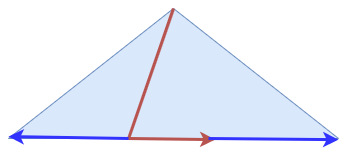

### 인덱스 효율성

- 인덱스를 스캔하는 단계에 처리하는 조건절은 엑세스 조건과 필터 조건으로 나뉜다.
- 인덱스 엑세스 조건은 인덱스 스캔 범위를 결정한다.
  - 인덱스 수직적 탐색을 통해서 인덱스 시작접을 결정하고, 어디서 멈출지를 결정하는데 영향을 미친다.
- 인덱스 필터조건은 테이블로 엑세스할지를 결정한는 조건절이다.
  - 커버링 인덱스와 같이 실제로 테이블에 접근하지 않는 경우들도 있다.
- 테이블 엑세스 단계에서 처리되는 조건절은 모두 필터 조건이다.
  - 테이블 필터 조건은 쿼리 수행 다음 단계로 전달하거나 최종 결과집합에 포함할지를 결정한다.

###  1. 인덱스 선행 컬럼이 등치(=) 조건이 아닐때 생기는 비효율
- 인덱스 스캔에서 조건절에 모두 등치 조건으로 활용되거나, 선행 컬럼은 등치 조건이면서 후행 컬럼은 범위 조건절로 활용될 때 인덱스 스캔이 효율적으로 활용된다.
```sql
select * from table where a = 1
select * from table where a = 1 and b between 1 and 3
select * from table where a = 1 and b = 1 and c between 1 and 3
```
> 여기서 인덱스 스캔이 효율적이라는 의미는 스캔을 하는 동안 필터링 되는 레코드가 없다는 의미이다.
- 만약 인덱스 선행컬럼이 범위 조건이고, 후행컬럼이 등치조건일 경우 인덱스 스캔의 비효율이 발생한다.
```sql
select * from table where a between 1 and 3 and b = 1
select * from table where a = 1 and a between 1 and 3 and c = 1
```
- 불필요한 인덱스까지 스캔하게 되면서 인덱스 필터 조건을 걸게된다.

### 2. NOT-EQUAL 조건으로 사용된 경우 생기는 비효율 ("<>", "NOT IN", "NOT BETWEEN", "IS NOT NULL")

- 인덱스를 사용하는 이유는 조건에 맞는 특정 레코드를 빠르게 찾기 위함이다.
- 하지만 부정문의 경우는 조건을 만족하지 않는 데이터를 필터링하여 레코드를 찾아야 하며, 이는 인덱스와 상반되는 원리를 가지고 있다.


#### 2.1. 만약 NOT-EQUAL 조건이 스캔이 가능하다면?
- 만약 NOT-EQUAL 인덱스 스캔이 가능하다는 가능하다면 어떤식으로 스캔을 하게될지 한 번 생각해보자.
- 먼저 수직적 탐색을 통해서 스캔의 시작지점을 찾고, 수평적 탐색을 통해서 그 스캔 종료지점을 찾게 될 것이다.
- 그 이후 시작점, 종료지점과 일치하지 않는 인덱스를 탐색하며 레코드를 가져오는 방식으로 진행될 것이다. 
  - 이는 곳 인덱스 풀 스캔 또는 테이블 풀 스캔과 다름없는 작업이 될 수 밖에 없다.
  - 특히 일치하지 않는 조건에 해당하는 양이 많으면 많을 수록 인덱스 스캔의 의미가 없어진다.


- 위 그림에서 빨간색 화살표가 인덱스 조건에 일치하는 수직적 탐색 및 수평적 탐색을 나타낸 것이고, 파랜색 화살표가 조건에 일치하지 않는 인덱스를 탐색하는 과정을 보여준다.
- 해당 그림에서 확인할 수 있듯이 이는 곳 풀 스캔과 다름없는 동작방식이다.
- 때문에 부정문을 활용하게 될 경우 인덱스 풀스캔 또는 테이블 풀 스캔이 일어나며, 이로 인하여 성능 저하가 발생할 수 있다.
- 이런 이유 뿐만 아니라 NOT-EQUAL 조건의 경우에는 가져와야할 데이터양이 일반적으로 많기 때문에 인덱스를 불필요하게 타지 않는다. 

####  2.2. 프라이머리 키 NOT-EQUAL 조건의 경우 범위 스캔이 발생하는 이유

- 세컨더리 인덱스의 경우에는 NOT-EQUALS 조건의 경우 풀스캔이 발생하는데 프라이머리 키의 경우에는 범위 스캔을 진행하는데 이러한 결과가 나타나는 이유가 뭘까?
- 물리적인 위치가 가깝기 때문에 옵티마이저가 다른 쿼리라도 날려주는 걸까?
```SQL
### 쿨러스터 인덱스 
explain select * from salaries where emp_no <> 10006;

+--+-----------+--------+----------+-----+-------------+-------+-------+----+-------+--------+-----------+
|id|select_type|table   |partitions|type |possible_keys|key    |key_len|ref |rows   |filtered|Extra      |
+--+-----------+--------+----------+-----+-------------+-------+-------+----+-------+--------+-----------+
|1 |SIMPLE     |salaries|null      |range|PRIMARY      |PRIMARY|4      |null|1289913|100     |Using where|
+--+-----------+--------+----------+-----+-------------+-------+-------+----+-------+--------+-----------+


### 세컨더리 인덱스
explain select * from salaries where salary <> 40006;
+--+-----------+--------+----------+----+-------------+----+-------+----+-------+--------+-----------+
|id|select_type|table   |partitions|type|possible_keys|key |key_len|ref |rows   |filtered|Extra      |
+--+-----------+--------+----------+----+-------------+----+-------+----+-------+--------+-----------+
|1 |SIMPLE     |salaries|null      |ALL |ix_salary    |null|null   |null|2579708|55.3    |Using where|
+--+-----------+--------+----------+----+-------------+----+-------+----+-------+--------+-----------+
```

### 3. 범위검색 조건을 남용할 때 생기는 비효율

- 다중 컬럼 인덱스에서 선행 컬럼을 범위 검색으로 활용할 경우, 인덱스 스캔의 비효율이 발생한다고 이야기했다.
- 그 이외에 범위 검색을 사용 시, 인덱스 스캔의 비효율이 일어나는지 한번 알아보자.

#### 2.1. BETWEEN
- BETWEEN은 많은 개발자들이 사용하는 SQL 조건문 중에 하나이다.
- BETWEEN의 경우 인덱스 수직적 탐색이후 수평적 탐색을 진행하며, 인덱스 후행 컬럼의 추가적인 조건으로 인해서 인덱스가 필터링 될 수 있다.
  - 인덱스가 필터링 되는 순간부터 인덱스 스캔의 비효율 성이 발생하는 것이다.
  - 때문에 BETWEEN 절에서의 조건 범위가 좁다면, IN 절을 활용하는 것이 스캔의 비효율 성을 줄여줄 수 있다.
  - IN 절의 경우에는 IN-iterator 방식으로 조회하게 된다.
  ```SQL
  -- age, name 순으로 인덱스 설정
  select * from employee where age in (15, 16, 17) and name = '홍길동';
  
  ## 세개의 조건을 UNION ALL 하여 정렬
  select * from employee where member_class = 15 and name = '홍길동';
  select * from employee where member_class = 16 and name = '홍길동';
  select * from employee where member_class = 17 and name = '홍길동';
  ```
  - 때문에 인덱스 선행 컬럼을 IN 절로 범위검색을 하여도 In-iterator 방식으로 조회되기 때문에 인덱스 스캔의 비효율이 발생하지 않는다.


#### 2.2. IN
- 앞서 설명한바와 같이 IN 절의 경우는 IN-iterator 방식으로 인덱스 스캔을 진행한다.
- 하지만 IN절 또한 너무 많은 조건을 입력하게 될경우 스캔의 비효율이 발생할 수 있다.
- 기본적으로 IN 절은 인덱스 수직적 탐색과 수평적 탐색을 계속 반복하여 해당 결과들을 UNION ALL하여 정렬을 수행한다고 하였다.
- IN절의 조건절들이 많지 않은 경우에는 왠만해서는 BETWEEN 절을 활용하는 것 보다는 IN 절의 성능이 더 좋은 성능을 발휘한다.
- 하지만 만약에 IN절의 조건이 1000개를 넘어가기 시작하면 오히려 비 효율적인 스캔 방식이 될 수 있다.
- 앞에서도 설명했지만 IN절은 IN-iterator 방식으로 진행되며 조건으로 걸린 것 만큼 인덱스 수직적 탐색과 수평적 탐색을 반복할 것이고, 뿐만 아니라 UNNION ALL과 정렬 작업까지 진행해야할기 때문이다.
- 이렇게 될 경우 데이터 베이스 메모리 이슈가 발생할 수 있다. JPA에서 batch_size를 통해서 lazy loading시 in절을 통해서 데이터를 들고 오기 위하여 데이터를 들고오게 되는데 있때, batch_size가 크면 클수록 문제가 발생할 수 있다.


#### 2.3. LIKE

- LIKE문의 경우 인덱스에 대해 잘 알지 못한다면 인덱스를 타지않는 일이 자주발생할 수 있다.
- 일단 인덱스의 특징 중에 하나는 인덱스 컬럼의 값들이 정렬되어 있다는 것이다.
- 문자열의 경우 a,b,c .... 순으로 정렬되어 있을 텐데 만약에 LIKE문을 통해서 해당 컬럼을 조회한다고 가정을 해보자.
```SQL
select * from comment where title like 'title%'
select * from comment where title like '%title'
select * from comment where title like '%title%'
```
- comment 테이블의 title컬럼에서 title에 관련된 문자열을 검색하는 쿼리이다.
- 첫번째 컬럼의 경우에는 인덱스를 활용할 수 있지만 두번째와 세번째의 경우에는 인덱스를 활용할 수 없다.
- 첫번째 조건의 경우 title 순으로 정렬되어 있는 인덱스 컬럼의 값만 스캔을 하면 되지만, 두번째와 세번째 컬럼의 경우에는 모든 인덱스를 스캔할 수 밖에 없다.
  - 때문에 LIKE 절을 잘못활용하는 경우 인덱스 풀스캔 또는 테이블 풀스캔이 일어날 수 있다.
- 테이블 내에 데이터가 많이 없거나, 사용자가 많이 없는 경우에는 LIKE 절을 두번째와 세번째 조건으로도 충분히 해결할 수 있지만, 사용자가 많거나 데이터 양이 많을 경우에는 단순히 LIKE절 만으로 해결할 수 없는 경우가 많다.
- 때문에 검색을 하기위하여 데이터베이스 하나만을 이용하여 해결하려 들지 말고, 전문검색을 지원하는 데이터베이스(elastic search) 또는 서드파티 툴을 활용하는 것이 좋다.

 

### 4. 페이징 쿼리 사용시 발생하는 비효율


- BETWEEN 절과 IN 절은 범위 검색을 위하여 많이들 활용하고 있지만 인덱스 스캔방식에는 차이가 존재한다.
- 먼저 BETWEEN의 스캔방식을 확인해보자.
- BETWEEN의 경우 인덱스 수직적 탐색이후 수평적 탐색을 진행하며, 추가적인 조건으로 인해서 인덱스가 필터링 될 수 있다.
  - 인덱스가 필터링될 경우, 해당 인덱스를 사용하기 위해서
- 간단하게 해결 가능하기 때문에 BETWEEN
- 

> https://jojoldu.tistory.com/529
> https://hoing.io/archives/24493
> https://jojoldu.tistory.com/565


### IN 조건 활용

### BETWEEN/LIKE 조건 활용


> Real MySql 8.0 개발자와 DBA를 위한 MySQL 실전 가이드, 백은비,이성욱, P247-253 <br/> 
> 친절한 SQL 튜닝, 조시형, P173-229