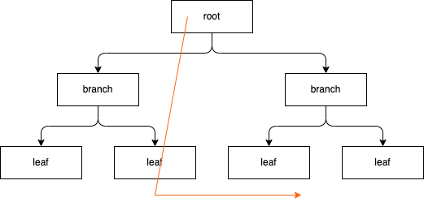
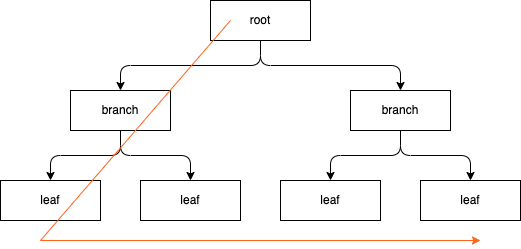

## 인덱스 스캔
---

- 옵티마이저의 실행계획을 통해서 MySQL이 어떻게 인덱스를 이용해 실제 레코드를 읽어들이는지를 알아야지 인덱스 튜닝이 가능하다.
- 때문에 인덱스를 통해서 레코드를 읽어들이는 몇 가지 방식에 대해서 알아보자.


### 1. 인덱스 레인지 스캔 (Index Range Scan)


- 인덱스 레인지 스캔은 인덱스 루트에서 리프 블록까지 수직적 탐색 이후, 필요한 범위만큼 스캔한다.

- 인덱스 자체의 정렬 특성 때문에 인덱스를 구성하는 컬럼의 정순 또는 역순으로 정렬된 상태로 레코드를 가져온다.
  - InnoDB 스토리지 엔진에서는 세컨더리 인덱스의 리프노드가 프라이머리 키 값을 가지고 있기 때문에 ORDER BY 절을 사용하지 않을 경우, 프라이머리 키값으로 정렬된 레코드를 가져온다.
- 인덱스 리프 노드에서 데이터를 가져올 때, 레코드 수만큼 랜덤 I/O가 발생하기 때문에 인덱스 스캔의 범위를 너무 크게 잡으면 성능상 좋지 않다.
> 인덱스를 통해서 읽어야 할 데이터 레코드가 20~25%를 넘으면 인덱스를 통한 읽기보다 테이블의 데이터를 직접 읽는 것이 더 효율적인 처리 방식이 된다.


### 2. 인덱스 풀 스캔 (Index Full Scan)


- 인덱스 레인지 스캔과는 달리 인덱스의 처음부터 끝까지 모두 읽는 방식을 인덱스 풀 스캔이라고 한다.
- 인덱스를 전체 스캔하는 단계에서 대부분의 레코드를 필터링하고 아주 일부분의 레코드만 테이블을 엑세스 하는 상황이라면 옵티마이저는 인덱스 풀 스캔 방식을 선택한다.
  - 인덱스가 테이블보다 크기가 작기 때문에 옵티마이저가 인덱스 풀 스캔이라는 방식을 선택하는 이유가 된다.
- 인덱스 풀 스캔은 인덱스를 통해서 레코드를 읽어들이기 때문에, 테이블 풀 스캔보다는 효율적이지만 적절한 인덱스가 없어서 차선책으로 선택한 방식이다.
  - 때문에 인덱스 풀 스캔이 자주일어난다면 인덱스 튜닝을 통해서 인덱스 레인지 스캔으로 변경해주는 것이 좋다.

#### 2.1. 인덱스 풀 스캔이 발생하는 경우
- 대부분의 레코드를 필터링하고 아주 일부분의 레코드만 테이블을 엑세스 하는 상황이라면 옵티마이저는 인덱스 풀 스캔 방식을 선택한다고했는데 어떤 경우에 주로 발생할까?
- 주로 다중 컬럼 인덱스가 걸려 있을 때 선두 컬럼을 활용하지 않으며, 쿼리의 결과가 인덱스에 존재하는 컬럼으로만 처리가 가능한 경우(커버링 인덱스) 인덱스 풀 스캔이 일어난다.
```sql
create table index_full_scan (
    name varchar(20) not null,
    age int not null
);

create index name_age_idx on index_full_scan(name, age);

insert into index_full_scan(name, age) value ('name1', 1);
insert into index_full_scan(name, age) value ('name2', 2);

-- 선두 컬럼(name)을 활용하지 않고, age 컬럼을 통해서 조회하고 있다.   
explain select name, age from index_full_scan where age > 1;

-- 결과값에서 type 컬럼의 값이 index, extra 컬럼의 값이 Using where; Using index인 것을 확인할 수 있다.
+--+-----------+---------------+----------+-----+-------------+------------+-------+----+----+--------+------------------------+
|id|select_type|table          |partitions|type |possible_keys|key         |key_len|ref |rows|filtered|Extra                   |
+--+-----------+---------------+----------+-----+-------------+------------+-------+----+----+--------+------------------------+
|1 |SIMPLE     |index_full_scan|null      |index|name_age_idx |name_age_idx|86     |null|2   |50      |Using where; Using index|
+--+-----------+---------------+----------+-----+-------------+------------+-------+----+----+--------+------------------------+

```
- 만약 해당 조회문의 수행빈도가 높고 인덱스의 크기가 크다면, age 컬럼을 인덱스로 따로 생성하는 것이 좋다.

> 커버링 인덱스 <br/>
> 레코드에 직접접근 하지 않고 인덱스를 통해서 결과를 반환할 수 있는데 이를 커버링 인덱스라 한다. <br/>
> 커버링 인덱스로 처리되는 쿼리는 디스크의 레코드를 읽지 않아도 되기 때문에 랜덤 I/O가 줄어들고 성능도 그만큼 빨라진다. <br/>
> 예를 들어서 인덱스 컬럼의 최솟값, 최대값을 반환하는 코드가 될 수 있다.


### 3. 인덱스 스킵 스캔 (Index Skip Scan)

- 조건절에 선두 컬럼을 활용하지 후행 컬럼을 통해서 조회하며 인덱스에 존재하는 컬럼으로 조회할 때, 옵티마이저는 인덱스 풀 스캔방식을 활용한다.
- 인덱스 풀 스캔은 테이블 풀 스캔에 비하면 좀 더 나은 스캔방식이기는 하지만 그렇다고 해서 효율적인 방식은 아니다.
- MySQL 8.0 부터는 인덱스 풀 스캔보다 효율적인 스캔 방식인 인덱스 스킵 스캔을 제공한다.
- 인덱스 스킵 스캔은 다중 컬럼 인덱스에서 선행 컬럼을 활용하지 않고, 후행 컬럼을 통해서 조회할 때 마치 인덱스 레인지 스캔 처럼 활용할 수 있도록 하는 스캔 방법이다.
- 사용자가 아래와 같은 쿼리를 실행했다면
```sql
-- gender, birth_date 순으로 두개의 컬럼이 인덱스가 걸려있는 경우

-- 사용자가 실행한 검색 쿼리
select gender, birth_date from member where birth_date >= '1965-02-01';

```
- 옵티마이저가 아래와 같은 쿼리로 최적화를 해주게된다.
```sql
-- gender, birth_date 인덱스 컬럼을 활용하기 때문에 인덱스 레인지 스캔이 가능하다.
select gender, birth_date from member where gender='M' and birth_date >= '1965-02-01';
select gender, birth_date from member where gender='F' and birth_date >= '1965-02-01';
```

- 하지만 인덱스 스킵스캔을 활용하기 위해서는 인덱스의 선행 컬럼의 유니크한 값의 개수가 적어야하며, 커버링 인덱스로만 활용할 수 있다는 제약조건이 있다. 


### 4. 루스 인덱스 스캔 (Loose Index Scan)

- 루스 인덱스 스캔은 인덱스 스킵 스캔과 비슷하기 필요한 인덱스만 읽어들이는 방식이다.
- 인덱스 레인지 스캔과 비슷하게 작동하지만 중간에 필요치 않은 인덱스 키 값은 무시하고 다음으로 넘어가는 형태로 처리한다.
- GROUP BY 또는 집합 함수 가운데 MAX() 또는 MIN() 함수에 대해 최적화를 하는 경우 사용된다.
```sql
-- dept_no, emp_no 두 개의 컬럼이 인덱스가 걸려 있을 때
select dept_no, min(emp_no)
from dept_emp
where dept_no between 'd002' and 'd004'
group by dept_no;
```
- 인덱스내에서 `dept_no asc, emp_no asc` 조합으로 정렬되어 있을 것이다.
- dept_no를 그룹 별로 첫 번째 레코드의 emp_no 값만 읽으면 된다.
- 즉, where 조건에 만족하는 범위 전체의 인덱스를 스캔할 필요가 없다.
- 위의 예시를 통해서 풀이하자면 인덱스 리프 노드를 스캔하면서 불필요한 부분은 그냥 무시하고 필요한 부분만 읽는 루프 인덱스 스캔을 사용하였다.

### 5. 인덱스 스캔 방향

- 인덱스를 생성할 때 정렬 순서를 설정할 수 있다. 때문에 무조건 오름차순으로만 정렬되어 있는 것은 아니다.
```sql
create index 인덱스 이름 on 테이블 (컬럼1 desc, 컬럼2 asc);
```
- 옵티마이저는 인덱스를 정렬 순서대로만 읽지만은 않는다.
  - 옵티마이적 실행 계획을 결정할 때, 인덱스가 오름차순으로 정렬되어 있는 상태여도 내림차순으로 읽는 것이 비용이 절감된다고 판단이 되면, 인덱스를 정렬 순서의 반대로 읽게된다.
  - 인덱스 정렬 순서대로 읽을 때 인덱스 정순 스캔(Index Forward Scan), 반대로 읽게되면 인덱스 역순 스캔(Index Backward Scan)이라고 한다.
  - 인덱스 역순 스캔이 가능한 이유는 인덱스 리프 노드의 구조가 양방향 연결 구조를 가지고 있기 때문이다.
- 리프노드가 양방향 연결 구조이기 때문에 인덱스 정순 스캔과 인덱스 역순 스캔의 비용은 비슷할 것으로 기대하지만 실제로는 그렇지 않으며 인덱스 역순 스캔이 인덱스 정순 스캔보다 느리다. 이러한 상황이 발생하는 이유는 아래와 같다.
  - 페이지 잠금이 인덱스 정순 스캔에 적합한 구조
  - 페이지 내에서 인덱스 레코드가 단방향으로 연결된 구조
- 왜 느린지를 알기전에 인덱스 페이지(노드)의 구조를 한번 알아보자

> https://dev.mysql.com/doc/refman/8.0/en/innodb-physical-structure.html
- 인덱스가 수평적 탐색(리프 페이지를 탐색)을 할 때 페이지 잠금을 획득하고 다시 해제하는 방식으로 탐색을 진행한다.
  - 보통 DB에 저장되는 데이터는 8KB 블럭을 단위로 저장하는데, 이를 노드 또는 페이지라고 한다.
  - 즉 루트, 브랜치, 리프 노드 안에는 인덱스 값 하나만 들어가 있는 것이 아닌, 여러 
-  
- 페이지 잠금이 Forward index scan에 적합한 구조
- 페이지 

> https://mangkyu.tistory.com/286
> https://tech.kakao.com/2018/06/19/mysql-ascending-index-vs-descending-index/


### 결론
- 인덱스 레인지 스캔을 제외하고, 나머지 스캔 방식의 경우 많은 제약조건들이 있다.
- 특히 대부분의 경우 인덱스의 선행 컬럼만 활용하거나 후행 컬럼만 활용했을 때, 그리고 커버링 인덱스가 가능할때 인덱스 풀 스캔, 인덱스 스킵 스캔, 인덱스 루스 스캔이 활용된다.
- 이는 곳 상당히 제한적으로 인덱스를 활용할 수 있다는 의미이며, 대부분의 경우 활용하지 못한다는 의미이기도 하다.
- 때문에 최대한 인덱스 레인지 스캔이 가능하도록 인덱스를 만들어 나가는 것이 좋아보인다.


