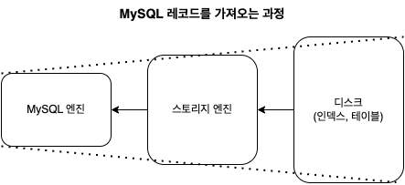

### 쿼리 실행 구조


### 옵티마이저
- 옵티마이저는 SQL 파싱 정보를 확인하면서 SQL실행을 최적화하기 위한 실행 계획을 수립한다.
  - 어떤 테이블로부터 읽고 어떤 인덱스를 사용할지 등.., 
- 기본적으로 MySQL은 비용 기반 최적화를 사용하며 다양한 실행 계획의 비용을 측정하고 그 중에서 가장 가장 저렴한 비용을 선택할려고 시도한다.


### 쿼리 실행 엔진 (Query Execution Engine)
- 쿼리 실행 엔진은 


### 스토리지 엔진 
- 쿼리 실행 엔진의 요청에 따라서 메모리나 디스크로부터 데이터를 읽어오거나 저장하는 역할을 담당한다.
  - 버퍼풀에 데이터가 존재할 경우 해당 데이터를 리턴하거나 (글로벌 메모리 영역), 사용자 요청에 따라 임시 메모리를 생성(로컬 메모리 영역)하여 데이터를 리턴한다.
- 스토리지 엔진에서 모든 데이터를 가공하고 리턴할거라고 예상되지만 실제로는 그렇지 않다.

- 디스크로부터 레코드를 읽어오는 작업은 스토리지 엔진이 담당하지만, 추가적인 연산이나 가공 작업은 MySQL 엔진에서 수행하게 된다.
- 때문에 단순히 인덱스를 통해서 레코드를 읽어들였다고 하더라도, MySQL 엔진에서의 추가적인 연산이나 가공작업이 많을 경우 클라이언트의 응답 속도가 저하될 수 있다.

#### MySQL엔진에서 추가적인 연산이나 가공 작업을 하는지 확인하기 
- MySQL 엔진 레이어에서 별도의 가공을 해서 필터링 작업을 처리한 경우에 `Extra` 컬럼에 `Using Where` 코멘트가 표시된다.
- `Using Where`는 실행 계획 `Extra` 컬럼에서 가장 흔하게 표시되는 값이지만, 왜 이런 값이 나오는지 이해할 수없을 때도 많다.
    - 특히 프라이머리 키로 조회 했을 때, `Using Where` 절이 나오는 경우가 흔하게 발생한다.
    ```sql
    -- emp_no는 primary key 값
    explain select * from query_execution where emp_no between 10000 and 10100;

    +--+-----------+---------------+----------+-----+-------------+-------+-------+----+----+--------+-----------+
    |id|select_type|table          |partitions|type |possible_keys|key    |key_len|ref |rows|filtered|Extra      |
    +--+-----------+---------------+----------+-----+-------------+-------+-------+----+----+--------+-----------+
    |1 |SIMPLE     |query_execution|null      |range|PRIMARY      |PRIMARY|4      |null|100 |100     |Using where|
    +--+-----------+---------------+----------+-----+-------------+-------+-------+----+----+--------+-----------+
    ```
- 때문에 실행 계획에서 filterd 컬럼의 값을 같이 확인하여 MySQL 엔진에서 필터링 되었는지를 확인할 수 있다.
  > filter 컬럼의 값은 필터링되고 버려지는 레코드 비율이 아닌, 필터링되고 남은 레코드의 비율을 의미한다. <br/>
  > filter 컬럼의 값은 정확히 예측되는 값이 아니므로 좀 더 정확히 예측하기 위해서는 히스토그램을 활용해야한다.


```sql
-- 인덱스 생성
create index ix_first_name_gender on query_execution (first_name, gender);
-- gender, first_name 일치 건수 : 326건
select count(*) from query_execution where gender = 'M' and first_name in ('Zvonko', 'Zongyan');
-- gender, first_name, last_name 일치 건수 : 3건
select count(*) from query_execution where gender = 'M' and first_name in ('Zvonko', 'Zongyan') and last_name = 'Spataro';

-- 실행 계획
explain select * from query_execution where gender = 'M' and first_name in ('Zvonko', 'Zongyan') and last_name = 'Spataro';

{
    "id": 1,
    "select_type": "SIMPLE",
    "table": "query_execution",
    "partitions": null,
    "type": "range",
    "possible_keys": "ix_first_name_gender",
    "key": "ix_first_name_gender",
    "key_len": "64",
    "ref": null,
    "rows": 326,
    "filtered": 10,
    "Extra": "Using index condition; Using where"
}
```

- `gender, first_name`를 만족하는 레코드 개수는 326건이고, gender, first_name, last_name을 만족하는 레코드 수는 3건이다.
- 스토리지 엔진에서 326건의 레코드를 읽고 MySQL엔진이 323건의 레코드를 필터링한것을 확인할 수 있다. 
  - filtered 컬럼의 값은 10으로 나오고 있다.
- 해당 쿼리는 인덱스를 타고있는 것처럼 보이지만, 실제로는 비효율적인 과정을 거치고 있다.
  - 최적화를 위해서는 `gender, first_name, last_name`에 전부 인덱스를 걸어야한다.


- 쿼리 실행 엔진은 옵티마이저가 만든 실행 계획을 완료하기 전까지 스토리지 엔진에 API 콜을 요청하는 중개자 역할을 한다.
- 실행 계획에 따른 결과가 나오기전까지 스토리지 엔진에게 지속적으로 요청한다.
- 스토리지 엔진은 인덱스를 탐색하여 테이블에서 행을 찾은 나머지 조건들에 대해서 
- 스토리지 엔진은 디스크나 메모리상에서 필요한 레코드를 읽거나 저장하는 역할

- 옵티마이저가 SQL 파싱 정보를 확인하면서 어떤 테이블로부터 읽고 어떤 인덱스를 이용해 테이블을 읽을지 선택한다.
- 테이블의 읽기 순서나 선택된 인덱스를 이용해 스토리지 엔진으로 부터 데이터를 가져옫온다.
- 스토리지 엔진으로 부터 받은 레코드를 MySQL엔진은 가공 또는 연산하는 작업을 수행

- MySQL 엔진의 쿼리 실행기에서 데이터를 쓰거나 읽어야 할 때 스토리지 엔진에서 쓰기 또는 읽기를 요청하며 

- MySQL 엔진은 스토리지 엔진으로 부터 받은 레코드를 가공 또는 연산하는 작업을 수행
- MySQL 엔진은 스토리지 엔진으로부터 받은 레코드를 가공 또는 연산하는 작업을 수행한다.

p489
### 스토리지 엔진

- 쿼리 실행 엔진의 요청에 따라서 디스크로부터 데이터를 읽어오거나 저장하는 역할을 담당한다.
  - 데이터를 저장하는 캐시를 가지고 있거나 (글로벌 메모리 영역), 사용자 요청에 따른 임시 메모리를 생성(로컬 메모리 영역)한다.

- 인덱스를 통해서 읽어오는 과정

1. 옵티마이저가 실행 계획을 만든다.
2. 쿼리 실행 엔진이 실행 계획을 완료하기 위하여 스토리지 엔진에게 지속적으로 요청한다.
3. 스토리지 엔진은 캐시에 데이터가 있으면 즉시 데이터를 반환하고 만약 없다면 아래와 같은 행동을 한다.
4. 인덱스를 통해서 데이터를 읽어온다.
5. 그 이외의 조건에 대해서는 스토리지 엔진이 직접 검사를 한다.


ICP는 스토리지 엔진이 기본 테이블에 액세스해야 하는 횟수와 MySQL 서버가 스토리지 엔진에 액세스해야 하는 횟수를 줄일 수 있습니다.

### MySQL 엔진

- 


- 데이터를 디스크 스토리지에 저장하거나 읽어오는 부분을 담당한다.
- 스토리지 엔진은 성능 향상을 위해서 캐시 기능을 내장하고 있다.


> https://shashwat-creator.medium.com/mysqls-logical-architecture-1-eaaa1f63ec2f
> https://dev.mysql.com/doc/refman/8.0/en/index-condition-pushdown-optimization.html
> https://jojoldu.tistory.com/474