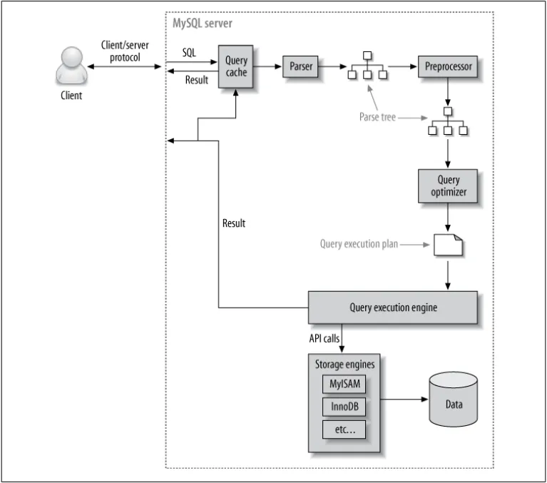

### 쿼리 실행 구조

- 쿼리 실행 엔진은 옵티마이저가 만든 실행 계획을 완료하기 전까지 스토리지 엔진에 API 콜을 요청하는 중개자 역할을 한다.
- 실행 계획에 따른 결과가 나오기전까지 스토리지 엔진에게 지속적으로 요청한다.
- 스토리지 엔진은 인덱스를 탐색하여 테이블에서 행을 찾은 나머지 조건들에 대해서 
- 스토리지 엔진은 디스크나 메모리상에서 필요한 레코드를 읽거나 저장하는 역할
- MySQL엔진은 스토리지 엔진으로 부터 받은 레코드를 가공 또는 연산하는 작업을 수행
- 
- MySQL 엔진은 스토리지 엔진으로부터 받은 레코드를 가공 또는 연산하는 작업을 수행한다.

p489
### 스토리지 엔진

- 쿼리 실행 엔진의 요청에 따라서 디스크로부터 데이터를 읽어오거나, 저장하는 역할을 담당한다.
- 데이터를 저장하는 캐시를 가지고 있거나 (글로벌 메모리 영역), 사용자 요청에 따른 임시 메모리를 생성(로컬 메모리 영역)한다.

- 인덱스를 통해서 읽어오는 과정

1. 옵티마이저가 실행 계획을 만든다.
2. 쿼리 실행 엔진이 실행 계획을 완료하기 위하여 스토리지 엔진에게 지속적으로 요청한다.
3. 스토리지 엔진은 캐시에 데이터가 있으면 즉시 데이터를 반환하고 만약 없다면 아래와 같은 행동을 한다.
4. 인덱스를 통해서 데이터를 읽어온다.
5. 그 이외의 조건에 대해서는 스토리지 엔진이 직접 검사를 한다.

ICP는 스토리지 엔진이 기본 테이블에 액세스해야 하는 횟수와 MySQL 서버가 스토리지 엔진에 액세스해야 하는 횟수를 줄일 수 있습니다.

### MySQL 엔진

- 

- 데이터를 디스크 스토리지에 저장하거나 읽어오는 부분을 담당한다.
- 스토리지 엔진은 성능 향상을 위해서 캐시 기능을 내장하고 있다.

> https://shashwat-creator.medium.com/mysqls-logical-architecture-1-eaaa1f63ec2f
> https://dev.mysql.com/doc/refman/8.0/en/index-condition-pushdown-optimization.html
> https://jojoldu.tistory.com/474