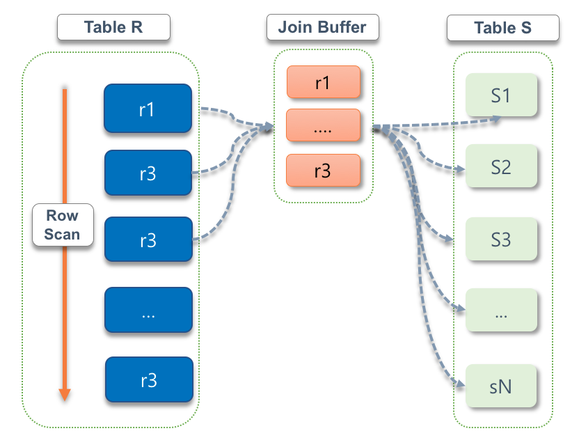

### 1. NL Join (Nested Loop Join)

- NL 조인은 드라이빙 테이블에서 하나의 행을 읽고 드라이빙 테이블에서 읽은 행을 통해서 조인 대상이 되는 드리븐 테이블의 행을 찾는 일련의 과정을 반복하며 결과 집합을 찾는 조인 방식이다.
- 한번에 하나씩 행을 읽어가며 조인을 수행하기 때문에 드리븐 테이블에 동일한 데이터를 여러번 읽을 수 있는 가능성이 있다.

#### 1.1. NL Join이 처리되는 과정

```sql
select *
from employees e join salaries s
on e.emp_no and s.emp_no;
```
- 위 쿼리를 통해서 NL Join이 수행되는 과정은 아래와 같이 처리된다.

```java
for (e in employees) {
    for (s in salaries) {
        if(e.emp_no == s.emp_no) {
            // 해당 조인 조건을 만족하기 때문에 해당 로우 조인 시도
        }
    }
}
```
- 위 과정에서 알 수 있듯이 NL Join이 수행되면 드라이빙 테이블에서 하나를 찾고 난 뒤에 드리븐 테이블에서 일치하는 레코드를 찾고 이를 반복하는 것을 확인할 수 있다.

### 2. 인덱스를 이용한 NL Join

- 기본적으로 NL 조인은 인덱스를 이용했을 때 사용된다. 여기서 이용하는 인덱스 이용 여부는 바로 조인 컬럼에 대한 인덱스를 사용했을 때 사용된다.
- 때문에 조인 컬럼에 인덱스를 걸었다고 하더라도, NL Join이 처리되는 과정을 모른다면 잘못된 테이블에 인덱스를 생성하거나 사용하여 느린 쿼리가 발생할 가능성이 높다. NL Join이 어떻게 인덱스를 이용하여 처리되는지를 이해하고 있어야 조인 쿼리 튜닝을 할 수 있다.

#### 2.1. 인덱스를 이용한 NL Join이 처리되는 과정

```sql
-- create index ix_hiredate on employees (hire_date);
-- create index ix_empno on test_salaries (emp_no);
select *
from test_employees e join test_salaries s
on e.emp_no = s.emp_no
where e.hire_date between '1985-01-01' and '1985-01-31';
```

- 위 쿼리는 test_salaries와 test_salaries 테이블을 조인하여 쿼리를 수행하게 된다.
- test_salaries 테이블은 ix_hiredate 인덱스를 가지고 있고, test_salaries 테이블은 ix_empno 인덱스를 가지고 있다.
- 아래는 NL Join이 어떻게 인덱스를 이용하여 처리하는지에 대한 일련의 과정을 설명한다.


1. 먼저 `ix_hiredate` 인덱스에서 `e.hire_date between '1985-01-01' and '1985-01-31'` 조건을 가진 가장 첫번째 레코드를 찾는다.
2. 이후 `ix_hiredate` 인덱스에서 읽은 ROWID를 통해서 `employees` 테이블의 레코드를 찾는다.
3. `employees` 테이블에서 읽은 `emp_no`를 통해서 `salaries`의 `ix_empno` 인덱스를 탐색한다.
4. `ix_empno` 인덱스의 첫번째 레코드를 찾은 이후 ROWID를 통해서 `salaries` 테이블의 레코드를 찾는다.
5. `ix_empno`에서 다음 블록을 스캔한 이후 `employees` 테이블에서 읽은 `emp_no`와 일치하는 지 확인한다.
6. 일치함으로 `ix_empno` 인덱스에서 ROWID를 통해 `salaries` 테이블의 레코드를 찾는다.
7. `ix_empno`에서 다음 블록을 스캔한 이후 `employees` 테이블에서 읽은 `emp_no와` 일치하는 지 확인한다. 
8. 일치하지 않기 때문에 인덱스 스캔을 멈춘다.
9. 쿼리에 대한 결과 집합이 나올 때 까지 1 ~ 8번 과정을 반복한다.

> NL 조인은 하나의 레코드를 읽어가며 순차적으로 진행된다는 특징이 있는데 이는 인덱스를 이용할 때도 동일하게 적용된다.

- 인덱스를 이용한 NL 조인에 대해서 먼저 알아보았는데, 만약 인덱스가 없을 경우에는 어떻게 처리되는지도 한번 알아보자.


#### 2.2. 조인 대상 컬럼에 인덱스가 없는 경우

```sql
-- create index ix_hiredate on test_employees (hire_date);
select *
from test_employees e join test_salaries s
on e.emp_no = s.emp_no
where e.hire_date between '1985-01-01' and '1985-01-31';
```


1. 먼저 `ix_hiredate` 인덱스에서 `e.hire_date between '1985-01-01' and '1985-01-31'` 조건을 가진 가장 첫번째 레코드를 찾는다.
2. 이후 `ix_hiredate` 인덱스에서 읽은 ROWID를 통해서 `test_employees` 테이블의 레코드를 찾는다.
3. `test_employees` 테이블에서 읽은 `emp_no`와 `salaries` 테이블의 `emp_no`가 일치하는 레코드를 찾는다. 해당 레코드를 찾는 과정에서 `test_salaries`은 `emp_no`컬럼에 관련된 인덱스가 없기 때문에 풀 테이블 스캔이 발생한다. 
4. 쿼리에 대한 결과 집합이 나올 때 까지 1 ~ 8번 과정을 반복한다.

```sql
+--+-----------+-----+----------+-----+-------------+-----------+-------+----+-------+--------+------------------------------------------+
|id|select_type|table|partitions|type |possible_keys|key        |key_len|ref |rows   |filtered|Extra                                     |
+--+-----------+-----+----------+-----+-------------+-----------+-------+----+-------+--------+------------------------------------------+
|1 |SIMPLE     |e    |null      |range|ix_hiredate  |ix_hiredate|3      |null|10     |100     |Using index condition                     |
|1 |SIMPLE     |s    |null      |ALL  |null         |null       |null   |null|2622070|10      |Using where; Using join buffer (hash join)|
+--+-----------+-----+----------+-----+-------------+-----------+-------+----+-------+--------+------------------------------------------+
```
- 조인 대상 컬럼에 인덱스가 없기 때문에 NL Join은 수행되지 않고 Hash Join을 수행했다는 것을 확인 할 수 있다.
- 조인을 수행할 때 테이블 풀 스캔이 일어나면 NL Join의 경우 모든 행을 건건히 비교해야하기 때문에 성능상 유리하지 않다. 때문에 Hash Join이 사용된다. 

#### 2.3. 드라이빙 테이블에 인덱스가 없는 경우

```sql
-- create index ix_empno on test_salaries (emp_no);
select *
from test_employees e join test_salaries s
on e.emp_no = s.emp_no
where e.hire_date between '1985-01-01' and '1985-01-31';
```


1. `test_employees` 테이블에서 `e.hire_date between '1985-01-01' and '1985-01-31'` 조건을 가진 가장 첫번째 레코드를 찾는다. 해당 레코드를 찾는 과정에서 `test_employees`은 `hire_date`컬럼에 관련된 인덱스가 없기 때문에 풀 테이블 스캔이 발생한다.
2. `test_employees` 테이블에서 읽은 `emp_no`를 통해서 `test_salaries`의 `ix_empno` 인덱스를 탐색한다.
3. `ix_empno` 인덱스의 첫번째 레코드를 찾은 이후 ROWID를 통해서 `test_salaries` 테이블의 레코드를 찾는다.
4. `ix_empno`에서 다음 블록을 스캔한 이후 `test_employees` 테이블에서 읽은 `emp_no`와 일치하는 지 확인한다.
5. 일치함으로 `ix_empno` 인덱스에서 ROWID를 통해 `test_salaries` 테이블의 레코드를 찾는다.
6. `ix_empno`에서 다음 블록을 스캔한 이후 `test_employees` 테이블에서 읽은 `emp_no`와 일치하는 지 확인한다. 
7. 일치하지 않기 때문에 인덱스 스캔을 멈춘다.
8. 쿼리에 대한 결과 집합이 나올 때 까지 1 ~ 8번 과정을 반복한다.


```sql
+--+-----------+-----+----------+----+-------------+--------+-------+------------------+------+--------+-----------+
|id|select_type|table|partitions|type|possible_keys|key     |key_len|ref               |rows  |filtered|Extra      |
+--+-----------+-----+----------+----+-------------+--------+-------+------------------+------+--------+-----------+
|1 |SIMPLE     |e    |null      |ALL |null         |null    |null   |null              |300332|11.11   |Using where|
|1 |SIMPLE     |s    |null      |ref |ix_empno     |ix_empno|4      |employees.e.emp_no|10    |100     |null       |
+--+-----------+-----+----------+----+-------------+--------+-------+------------------+------+--------+-----------+
```
- 조인을 수행했을 때 조인 컬럼 인덱스를 활용하여 NL Join 수행된다.
- 하지만 `employees` 레코드를 조회할 때 `e.hire_date between '1985-01-01' and '1985-01-31'`의 조건에 일치하는 데이터를 찾기 위하여 테이블 풀 스캔이 발생한 것을 확인할 수 있다.


#### 2.4. 인덱스를 이용한 NL Join의 특징
1. 인덱스를 이용한 NL 조인의 가장 큰 특징은 한 레코드씩 순차적으로 진행한다는 점이다. 이러한 특징 때문에 대량의 데이터를 조인하게 될 경우 불리하다.
2. 드라이빙 테이블에 엑세스해야하는 레코드양에 따라서 조인 대상이 되는 전체 테이블에 대한 엑세스양이 결정된다는 특징이 있다. 때문에 드라이빙 테이블에 의해 나오는 전체 레코드양이 많다면 드리븐 테이블에 대한 인덱스를 효율적으로 만든다고 하여도 느린 쿼리가 발생할 확률이 높다.  

> NL 조인은 소량의 데이터를 처리하기위해서 유리하며, 조인 대상이 대한 테이블의 인덱스가 있냐 없냐에 따라서 조인 효율이 크게 달라지기 때문에 인덱스 구성 전략이 중요하다.


### 3. BNL Join (Block Nested Loop Join)



- NL Join의 경우 대용량 데이터에 대한 조인이 불리한데, BNL Join은 NL Join의 한계를 개선하기 위해서 도입된 조인 방식이다.
> MySQL 8.0 버전 이후 Hash Join이 도입된 이후로는 대용량 데이터 조인의 경우 Hash Join을 활용한다. MySQL 8.0 이하 버전에서는 NL Join만 존재하였기 때문에 NL Join의 한계를 극복하기 위하여 BNL Join이 도입되었다. 하지만 BNL Join은 NL Join보다는 빠르지만 근본적인 해결책을 제시해줄 수 있는 것은 아니다. 우리가 알아야 할 내용은 중첩 루프를 사용하여 일치하는 데이터를 찾고자 할 때, 버퍼를 사용하여 조금 더 나은 성능을 기대할 수 있다는 것을 아는 것이 중요하다.
- BNL Join은 조인 버퍼를 이용하여 드라이빙 테이블의 조인 컬럼을 조인 버퍼에 저장한 이후 해당 조인 버퍼를 이용하여 드리븐 테이블을 스캔하는 방식이다.
- 드라이빙 테이블의 조인 컬럼을 조인 버퍼에 저장하고, 해당 데이터를 드리븐 테이블과 비교를 하기 때문에 내부 스캔 횟수를 줄일 수 있다.
  - 스캔 횟수를 줄인다는 말은 I/O 비용을 줄일 수 있다는 의미이기도 하다.


#### 3.1. BNL Join이 처리되는 과정

- 드리븐 테이블과 드라이빙 테이블에는 100개의 행이 존재하고 `join_buffer_size`가 10이라고 가정해보자.

```sql
select *
from drivingTable join drivenTable
on drivingTable.value and drivenTable.value;
```

- 위 쿼리를 통해서 BNL Join이 수행되는 과정은 아래와 같이 처리된다.

```java
//데이터 셋팅
int joinBufferSize = 10;
int rowSize = 100;

int[] joinBuffer = new int[joinBufferSize];
int[] drivingTable = new int[rowSize];
int[] drivenTable = new int[rowSize];

for (int i = 1; i <= rowSize; i++) {
    drivingTable[i -1] = i;
    drivenTable[i -1] = i;
}

for (int i = 0; i < drivingTable.length; i++) { //10
    //조인 버퍼 SET
    joinBuffer[i % joinBufferSize] = drivingTable[i];
    boolean isFullJoinBuffer = (i + 1) % joinBufferSize == 0;
    if(isFullJoinBuffer){   //조인 버퍼 FULL
        for (int j = 0; j < joinBuffer.length; j++) {
            for (int k = 0; k < drivenTable.length; k++) { // 100 * 10
                if(drivenTable[k] == joinBuffer[j]){
                    System.out.println("조인 컬럼 기준이 일치함");
                }
            }
        }
    }
    //조인 버퍼 CLEAR
}
```

- 드라이빙 테이블에는 100개의 행이 있고, join_buffer_size는 10이기 때문에 드리븐 테이블은 10개의 행을 비교하면 된다.
- 만약 NL Join을 사용했을 경우 100회의 루프 순환을 하게 되지만, BNL Join은 조인 버퍼를 활용하여 100/10 = 10회 루프 순환 하면서 내부 스캔 횟수를 90% 줄였다.

> 현재 드는 생각은 NL Join의 경우 레코드 단위로 처리를 하기 때문에 랜덤 엑세스 I/O가 발생하지만, BNL Join의 경우 조인 버퍼를 사용하기 때문에 드라이빙 테이블에서 순차 I/O가 가능하다는게 특징이 아닌가 라는 생각이 든다.  


> https://dev.mysql.com/doc/refman/8.2/en/nested-loop-joins.html <br/>
> https://dev.mysql.com/doc/refman/8.2/en/nested-join-optimization.html <br/>
> https://hoing.io/archives/24491 <br/>
> 친절한 SQL 튜닝, 조시형, P255-273 <br/>

