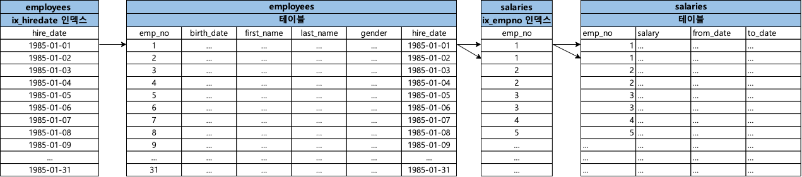

### 1. NL Join (Nested Loop Join)

- NL 조인은 드라이빙 테이블에서 하나의 행을 읽고 드라이빙 테이블에서 읽은 행을 통해서 조인 대상이 되는 드리븐 테이블의 행을 찾는 일련의 과정을 반복하며 결과 집합을 찾는 조인 방식이다.
- 한번에 하나씩 행을 읽어가며 조인을 수행하기 때문에 드리븐 테이블에 동일한 데이터를 여러번 읽을 수 있는 가능성이 있다.

#### 1.1. NL Join이 처리되는 과정

```sql
select *
from employees e join salaries s
on e.emp_no and s.emp_no;
```

```java
for (e in employees) {
    for (s in salaries) {
        if(e.emp_no == s.emp_no) {
            // 해당 행이 조인을 만족
            break;
        }
    }
}
```
- 위의 그림에서 알 수 있듯이 NL 조인이 수행되면 드라이빙 테이블에서 하나를 찾고 난 뒤에 드리븐 테이블에서 일치하는 레코드를 찾고 이를 반복하는 것을 확인할 수 있다.

### 2. 인덱스를 이용한 NL Join

- 아무런 인덱스 없이 조인을 수행하게 될 경우 느린 쿼리가 발생할 가능성이 높다. 만약 조인 대상이 되는 테이블들에게 인덱스를 걸었다고 하더라도 인덱스를 이용한 NL Join인 처리되는 과정을 모른다면 잘못된 인덱스를 사용하게 되며 느린 쿼리가 발생할 가능성이 높다. 때문에 조인의 기본 방식인 NL Join이 어떻게 인덱스를 이용하여 처리되는지를 이해하고 있어야 조인 쿼리 튜닝을 할 수 있다.


#### 2.1. 인덱스를 이용한 NL Join이 처리되는 과정

```sql
-- create index ix_hiredate on employees (hire_date);
-- create index ix_empno on salaries (emp_no);
select *
from test_employees e join test_salaries s
on e.emp_no = s.emp_no
where e.hire_date between '1985-01-01' and '1985-01-31';
```

- 위 쿼리는 test_salaries와 test_salaries 테이블을 조인하여 쿼리를 수행하게 된다.
- test_salaries 테이블은 ix_hiredate 인덱스를 가지고 있고, test_salaries 테이블은 ix_empno 인덱스를 가지고 있다.
- 아래는 NL Join이 어떻게 인덱스를 이용하여 처리하는지에 대한 일련의 과정을 설명한다.



1. 먼저 `ix_hiredate` 인덱스에서 `e.hire_date between '1985-01-01' and '1985-02-01'` 조건을 가진 가장 첫번째 레코드를 찾는다.
2. 이후 `ix_hiredate` 인덱스에서 읽은 ROWID를 통해서 `employees` 테이블의 레코드를 찾는다.
3. `employees` 테이블에서 읽은 `emp_no`를 통해서 `salaries`의 `ix_empno` 인덱스를 탐색한다.
4. `ix_empno` 인덱스의 첫번째 레코드를 찾은 이후 ROWID를 통해서 `salaries` 테이블의 레코드를 찾는다.
5. `ix_empno`에서 다음 블록을 스캔한 이후 `employees` 테이블에서 읽은 `emp_no`와 일치하는 지 확인한다.
6. 일치함으로 `ix_empno` 인덱스에서 ROWID를 통해 `salaries` 테이블의 레코드를 찾는다.
7. `ix_empno`에서 다음 블록을 스캔한 이후 `employees` 테이블에서 읽은 `emp_no와` 일치하는 지 확인한다. 
8. 일치하지 않기 때문에 인덱스 스캔을 멈춘다.
9. 쿼리에 대한 결과 집합이 나올 때 까지 1 ~ 8번 과정을 반복한다.

> NL 조인은 하나의 레코드를 읽어가며 순차적으로 진행된다는 특징이 있는데 이는 인덱스를 이용할 때도 동일하게 적용된다.

#### 2.2. 드라이빙 테이블에 인덱스가 없는 경우

#### 2.3. 드리븐 테이블에 인덱스가 없는 경우

#### 2.4. 인덱스를 이용한 NL Join의 특징


10. 드라이빙 테이블에서 인덱스 처리
11. 드리븐 테이블에서 인덱스 처리


### NL Join 튜닝

###  NL Join 인덱스 전략 구성

### NL Join의 특징

- NL 조인의 가장 큰 특징 중 하나는 한 레코드 씩 순차적으로 진행을 하여 결과 집합을 클라이언트에게 전달한다.
- NL 조인은 랜덤 엑세스 위주의 조인 방식이다. 한 레코드씩 순차적으로 읽으며 진행하기 때문에, 하나의 레코드를 읽으려할 때 마다 인덱스를 통한 블록 I/O가 지속 적으로 발생하기 때문에 대량 데이터를 NL 조인할 때는 불리하다.  

> https://dev.mysql.com/doc/refman/8.2/en/nested-loop-joins.html
> 친절한 SQL 튜닝, 조시형, P255-273

