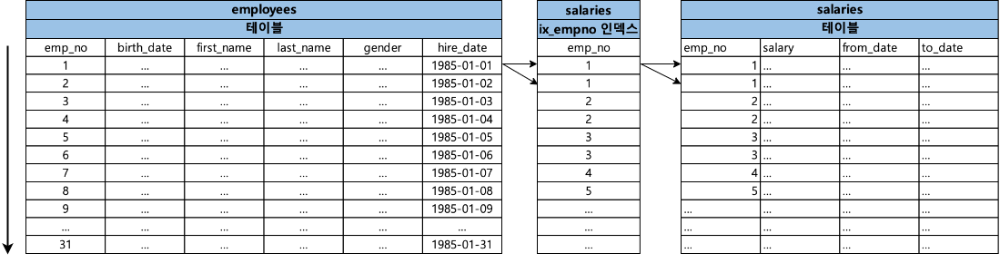
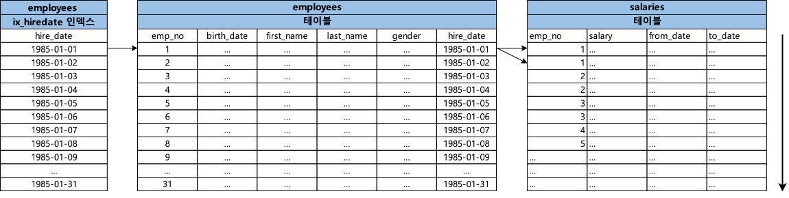

### 1. NL Join (Nested Loop Join)

- NL 조인은 드라이빙 테이블에서 하나의 행을 읽고 드라이빙 테이블에서 읽은 행을 통해서 조인 대상이 되는 드리븐 테이블의 행을 찾는 일련의 과정을 반복하며 결과 집합을 찾는 조인 방식이다.
- 한번에 하나씩 행을 읽어가며 조인을 수행하기 때문에 드리븐 테이블에 동일한 데이터를 여러번 읽을 수 있는 가능성이 있다.

#### 1.1. NL Join이 처리되는 과정

```sql
select *
from employees e join salaries s
on e.emp_no and s.emp_no;
```

```java
for (e in employees) {
    for (s in salaries) {
        if(e.emp_no == s.emp_no) {
            // 해당 행이 조인을 만족
            break;
        }
    }
}
```
- 위의 그림에서 알 수 있듯이 NL 조인이 수행되면 드라이빙 테이블에서 하나를 찾고 난 뒤에 드리븐 테이블에서 일치하는 레코드를 찾고 이를 반복하는 것을 확인할 수 있다.

### 2. 인덱스를 이용한 NL Join

- 아무런 인덱스 없이 조인을 수행하게 될 경우 느린 쿼리가 발생할 가능성이 높다. 만약 조인 대상이 되는 테이블들에게 인덱스를 걸었다고 하더라도 인덱스를 이용한 NL Join인 처리되는 과정을 모른다면 잘못된 인덱스를 사용하게 되며 느린 쿼리가 발생할 가능성이 높다. 때문에 조인의 기본 방식인 NL Join이 어떻게 인덱스를 이용하여 처리되는지를 이해하고 있어야 조인 쿼리 튜닝을 할 수 있다.


#### 2.1. 인덱스를 이용한 NL Join이 처리되는 과정

```sql
-- create index ix_hiredate on employees (hire_date);
-- create index ix_empno on test_salaries (emp_no);
select *
from test_employees e join test_salaries s
on e.emp_no = s.emp_no
where e.hire_date between '1985-01-01' and '1985-01-31';
```

- 위 쿼리는 test_salaries와 test_salaries 테이블을 조인하여 쿼리를 수행하게 된다.
- test_salaries 테이블은 ix_hiredate 인덱스를 가지고 있고, test_salaries 테이블은 ix_empno 인덱스를 가지고 있다.
- 아래는 NL Join이 어떻게 인덱스를 이용하여 처리하는지에 대한 일련의 과정을 설명한다.


1. 먼저 `ix_hiredate` 인덱스에서 `e.hire_date between '1985-01-01' and '1985-01-31'` 조건을 가진 가장 첫번째 레코드를 찾는다.
2. 이후 `ix_hiredate` 인덱스에서 읽은 ROWID를 통해서 `employees` 테이블의 레코드를 찾는다.
3. `employees` 테이블에서 읽은 `emp_no`를 통해서 `salaries`의 `ix_empno` 인덱스를 탐색한다.
4. `ix_empno` 인덱스의 첫번째 레코드를 찾은 이후 ROWID를 통해서 `salaries` 테이블의 레코드를 찾는다.
5. `ix_empno`에서 다음 블록을 스캔한 이후 `employees` 테이블에서 읽은 `emp_no`와 일치하는 지 확인한다.
6. 일치함으로 `ix_empno` 인덱스에서 ROWID를 통해 `salaries` 테이블의 레코드를 찾는다.
7. `ix_empno`에서 다음 블록을 스캔한 이후 `employees` 테이블에서 읽은 `emp_no와` 일치하는 지 확인한다. 
8. 일치하지 않기 때문에 인덱스 스캔을 멈춘다.
9. 쿼리에 대한 결과 집합이 나올 때 까지 1 ~ 8번 과정을 반복한다.

> NL 조인은 하나의 레코드를 읽어가며 순차적으로 진행된다는 특징이 있는데 이는 인덱스를 이용할 때도 동일하게 적용된다.

- 인덱스를 이용한 NL 조인에 대해서 먼저 알아보았는데, 그렇다면 만약 드라이빙 테이블이나 드리븐 테이블에 인덱스가 없다면 어떻게 조인이 처리되는지에 대한 과정도 한번 알아보자.

#### 2.2. 드라이빙 테이블에 인덱스가 없는 경우

```sql
-- create index ix_empno on test_salaries (emp_no);
select *
from test_employees e join test_salaries s
on e.emp_no = s.emp_no
where e.hire_date between '1985-01-01' and '1985-01-31';
```



1. `test_employees` 테이블에서 `e.hire_date between '1985-01-01' and '1985-01-31'` 조건을 가진 가장 첫번째 레코드를 찾는다. 해당 레코드를 찾는 과정에서 `test_employees`은 `hire_date`컬럼에 관련된 인덱스가 없기 때문에 풀 테이블 스캔이 발생한다.
2. `employees` 테이블에서 읽은 `emp_no`를 통해서 `salaries`의 `ix_empno` 인덱스를 탐색한다.
3. `ix_empno` 인덱스의 첫번째 레코드를 찾은 이후 ROWID를 통해서 `salaries` 테이블의 레코드를 찾는다.
4. `ix_empno`에서 다음 블록을 스캔한 이후 `employees` 테이블에서 읽은 `emp_no`와 일치하는 지 확인한다.
5. 일치함으로 `ix_empno` 인덱스에서 ROWID를 통해 `salaries` 테이블의 레코드를 찾는다.
6. `ix_empno`에서 다음 블록을 스캔한 이후 `employees` 테이블에서 읽은 `emp_no와` 일치하는 지 확인한다. 
7. 일치하지 않기 때문에 인덱스 스캔을 멈춘다.
8. 쿼리에 대한 결과 집합이 나올 때 까지 1 ~ 8번 과정을 반복한다.


```sql
+--+-----------+-----+----------+----+-------------+--------+-------+------------------+------+--------+-----------+
|id|select_type|table|partitions|type|possible_keys|key     |key_len|ref               |rows  |filtered|Extra      |
+--+-----------+-----+----------+----+-------------+--------+-------+------------------+------+--------+-----------+
|1 |SIMPLE     |e    |null      |ALL |null         |null    |null   |null              |300332|11.11   |Using where|
|1 |SIMPLE     |s    |null      |ref |ix_empno     |ix_empno|4      |employees.e.emp_no|10    |100     |null       |
+--+-----------+-----+----------+----+-------------+--------+-------+------------------+------+--------+-----------+
```
- 실행 계획을 확인해보면 test_employees 테이블은 테이블 풀 스캔이 일어나고, test_salaries 테이블은 인덱스를 활용한 것을 확인할 수 있다.
- 실행 계획에는 나오지 않았지만 NL 조인은 하나의 레코드를 읽어가며 순차적으로 진행된다는 특징이 있기 때문에 실제로 `e.hire_date between '1985-01-01' and '1985-01-31'` 조건으로 인해서 test_employees 테이블 대상으로 많은 테이블 풀스캔이 일어났을 가능성이 있다.
- 이는 느린 쿼리를 발생시킬 확률이 높다.

#### 2.3. 드리븐 테이블에 인덱스가 없는 경우

```sql
-- create index ix_hiredate on test_employees (hire_date);
select *
from test_employees e join test_salaries s
on e.emp_no = s.emp_no
where e.hire_date between '1985-01-01' and '1985-01-31';
```



1. 먼저 `ix_hiredate` 인덱스에서 `e.hire_date between '1985-01-01' and '1985-01-31'` 조건을 가진 가장 첫번째 레코드를 찾는다.
2. 이후 `ix_hiredate` 인덱스에서 읽은 ROWID를 통해서 `employees` 테이블의 레코드를 찾는다.
3. `employees` 테이블에서 읽은 `emp_no`와 `salaries` 테이블의 `emp_no`가 일치하는 레코드를 찾는다. 해당 레코드를 찾는 과정에서 `salaries`은 `emp_no`컬럼에 관련된 인덱스가 없기 때문에 풀 테이블 스캔이 발생한다. 
4. 쿼리에 대한 결과 집합이 나올 때 까지 1 ~ 8번 과정을 반복한다.

```sql
+--+-----------+-----+----------+-----+-------------+-----------+-------+----+-------+--------+------------------------------------------+
|id|select_type|table|partitions|type |possible_keys|key        |key_len|ref |rows   |filtered|Extra                                     |
+--+-----------+-----+----------+-----+-------------+-----------+-------+----+-------+--------+------------------------------------------+
|1 |SIMPLE     |e    |null      |range|ix_hiredate  |ix_hiredate|3      |null|10     |100     |Using index condition                     |
|1 |SIMPLE     |s    |null      |ALL  |null         |null       |null   |null|2622070|10      |Using where; Using join buffer (hash join)|
+--+-----------+-----+----------+-----+-------------+-----------+-------+----+-------+--------+------------------------------------------+
```
- 실행 계획을 확인해보면 test_employees 테이블은 인덱스를 활용하고, test_salaries 테이블은 테이블 풀 스캔이 발생한 것을 확인할 수 있다.
- 실행 계획에는 나오지 않았지만 NL 조인은 하나의 레코드를 읽어가며 순차적으로 진행된다는 특징이 있기 때문에 실제로 `on e.emp_no = s.emp_no` 조건으로 인해서 test_salaries 테이블 대상으로 총 많은 테이블 풀스캔이 일어났을 가능성이 있다.
- 이는 느린 쿼리를 발생시킬 확률이 높다.


#### 2.4. 인덱스를 이용한 NL Join의 특징
- 인덱스를 이용한 NL 조인의 가장 큰 특징은 한 레코드씩 순차적으로 진행한다는 점이다. 이러한 특징 때문에 대량의 데이터를 조인하게 될 경우 불리하다.
- 드라이빙 테이블에 엑세스해야하는 레코드양에 따라서 조인 대상이 되는 전체 테이블에 대한 엑세스양이 결정된다는 특징이 있다. 때문에 드라이빙 테이블에 의해 나오는 전체 레코드양이 많다면 드리븐테이블에 대한 인덱스를 효율적으로 만든다고 하여도 느린 쿼리가 발생할 확률이 높다.  
- 때문에 NL 조인은 소량의 데이터를 처리하기위해서 유리하며, 조인 대상이 대한 테이블의 인덱스가 있냐 없냐에 따라서 조인 효율이 크게 달라지기 때문에 인덱스 구성 전략이 중요하다.


> https://dev.mysql.com/doc/refman/8.2/en/nested-loop-joins.html <br/>
> https://dev.mysql.com/doc/refman/8.2/en/nested-join-optimization.html <br/>
> 친절한 SQL 튜닝, 조시형, P255-273 <br/>

