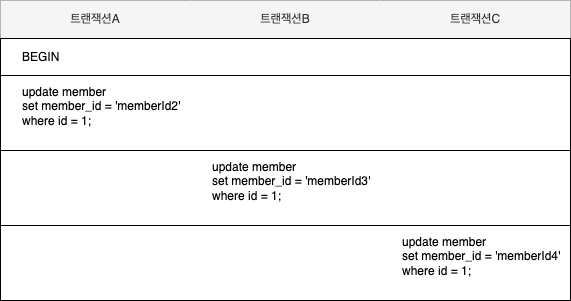

### 1. 잠금 (Lock)
---

- 데이터베이스의 잠금 기능은 ***동시성을 제어하기 위한 기능***이다.
- 하나의 레코드를 여러 커넥션에서 동시에 접근하여 변경하려고 할 때, 잠금이 없다면 하나의 데이터를 여러 커넥션이 동시에 변경할 수 있다.
- 잠금은 여러 ***커넥션에서 동시에 요청할 경우, 순서대로 한 시점에 하나의 커넥션만 데이터를 변경할 수 있게 해주는 역할***을 한다.  
- MySQL에서는 MVCC 기술을 통해서 잠금 없는 일관성 읽기를 수행할 수 잇다. 때문에 하나의 레코드에 동시에 접근하여 데이터를 작성하게 될 경우 주로 잠금이 발생한다.

### 2. InnoDB 스토리지 엔진 잠금
---

- InnoDB 스토리지 엔진 잠금은 스토리지 엔진 내부에서 ***레코드 기반 잠금 방식을 지원***한다.
- `information_schema` 데이터베이스에 존재하는 `INNODB_TRX, INNODB_LOCKS, INNODB_LOCK_WAITS` 테이블을 통해서 현재 트랜잭션의 잠금 상태를 확인할 수 있다. 
  - 현재 어떤 트랜잭션이 어떤 잠금을 대기하는지 확인 가능
  - 해당 잠금을 어느 트랜잭션이 가지고 있는지 확인 가능
  - 장시간 잠금을 가지고 있는 클라이언트를 찾아서 종료도 가능 

#### 2.1. 레코드 락 (Record Lock)
- 레코드 자체만을 잠그는 것을 레코드 락이라고 하며, 다른 상용 DBMS의 레코드 락과 동일한 역할을 한다.
- InnoDB 스토리지 엔진은 ***레코드 자체가 아니라 인덱스의 레코드를 잠근다는점이 다른 사용 DBMS와 조금 다른 점***이다.

#### 2.2. 인덱스 잠금
- InnoDB의 잠금 방식은 레코드를 잠그는 것이 아닌, 인덱스를 잠그는 방식으로 처리된다.
- 인덱스를 잠그는 방식이기 때문에 ***조건을 통해서 데이터를 변경할 때 해당 인덱스에 포함되어 있는 모든 레코드를 잠그게 된다.***
  - 때문에 카디널리티(유니크한 값의 개수)가 낮은 인덱스를 통해서 변경작업을 하게되면 다른 클라이언트는 그 테이블을 변경하지 못하고 기다려야하는 상황이 발생할 수 있다. (인덱스 설계가 중요)
- 인덱스가 없다면 테이블을 풀 스캔하면서 UPDATE 작업을 하는데, 이 과정에서 테이블에 있는 모든 레코드를 잠그게 된다.

#### 2.2.1. 인덱스 잠금 확인하기

1. 인덱스 잠금 확인을 위한 테이블 및 인덱스 생성
  ```sql
  create table index_lock(
      gender varchar(1),
      name varchar(20)
  );

  -- 성별 컬럼에 인덱스를 생성하였다. 성별은 M, F 밖에 없다.
  create index ix_gender on index_lock (gender);

  insert into index_lock (gender, name) value ('M', 'name1');
  insert into index_lock (gender, name) value ('M', 'name2');
  ```

2. 트랜잭션 A에서 인덱스를 통해서 데이터 변경
  ```sql
  start transaction;

  update index_lock set name = 'name11' where gender = 'M' and name = 'name1';
  select '트랜잭션 A UPDATE';
  -- 인덱스 잠금을 확인하기 위한 sleep문
  do sleep(30);

  select '트랜잭션 A 작업 완료';

  commit;
  ```

3. 트랜잭션 B에서 인덱스를 통해서 데이터 변경시 인덱스 잠금이 이뤄지는지 확인
  ```sql
  start transaction;
  -- 트랜잭션 A에서 인덱스를 통해서 데이터 변경을 했을 때, 트랜잭션 B에서 인덱스 잠금이 되는지 확인
  update index_lock set name = 'name22' where gender = 'M' and name = 'name2';
  select '트랜잭션 B UPDATE';

  do sleep(30);

  select '트랜잭션 B 작업 완료';

  commit;
  ```
- 트랜잭션 A에서 데이터 변경 시, 인덱스 잠금으로 인해서 트랜잭션 B에서 `select '트랜잭션 B UPDATE'` 쿼리가 실행되지 않는것을 확인할 수 있다.

#### 2.2.2. 인덱스가 아닌 컬럼을 통해서 변경 작업 시 잠금 확인하기

1. 인덱스가 아닌 컬럼을 통해서 변경 작업 시, 잠금 확인을 위한 테이블 및 데이터 생성 
  ```sql
  create table no_index_lock(
      name varchar(20)
  );

  insert into no_index_lock (name) value ('name1');
  insert into no_index_lock (name) value ('name2');
  ```
2. 트랜잭션 A에서 데이터 변경
  ```sql
  start transaction;

  update no_index_lock set name = 'name11' where name = 'name1';
  select '트랜잭션 A UPDATE';
  -- 테이블 플스캔으로 인해서 테이블 잠금이 일어나는지 확인하기 위한 sleep문 
  do sleep(30);

  select '트랜잭션 A 작업 완료';

  commit;
  ```
3. 트랜잭션 B에서 데이터 변경
  ```sql
  start transaction;
  -- 트랜잭션 A에서 데이터 변경을 했을 때, 트랜잭션 B에서 잠금이 되는지 확인
  update no_index_lock set name = 'name22' where name = 'name2';
  select '트랜잭션 B UPDATE';

  do sleep(30);

  select '트랜잭션 B 작업 완료';

  commit;
  ```
- 트랜잭션 A에서 인덱스가 없는 컬럼을 통해서 데이터 변경 시, 테이블을 풀스캔하여 UPDATE 하는 작업으로 인해서 전체 레코드를 잠그는 것을 확인할 수 있다.
- 트랜잭션 B에서 `select '트랜잭션 B UPDATE'` 쿼리가 실행되지 않는것을 확인할 수 있다.


#### 2.3. 갭락(Gap Lock)
- 갭 락은 레코드 자체가 아니라 ***레코드와 바로 인접한 레코드 사이의 간격만을 잠그는 것을 의미***한다.
  - 레코드 사이의 간격에 새로운 레코드가 생성되거나 삭제되는 것을 제어한다.
- MySQL은 레코드 잠금이 아닌, 인덱스 잠금을 수행하기 때문에 아직 존재하지는 않지만 지정된 범위에 해당하는 인덱스 테이블 공간을 대상으로 잠금을 거는 것이 아닌지 유추해볼 수 있다.


#### 2.3.1. 갭락 확인해보기

1. 갭락을 확인하기 위한 테이블 및 인덱스, 데이터 생성
  ```sql
  create table gap_lock (
      name varchar(20),
      age int
  );

  create index ix_name on gap_lock (name);

  insert into gap_lock(name, age) value ('name1', 10);
  insert into gap_lock(name, age) value ('name2', 10);
  ```
2. 트랜잭션 A에서 인덱스를 통해서 특정 컬럼 변경
  ```sql
  start transaction;

  update gap_lock set age = 20 where name like 'name%';
  select '트랜잭션 A UPDATE';
  -- 갭 락을 확인하기 위한 sleep문
  do sleep(30);

  select '트랜잭션 A 작업 완료';

  commit;
  ```
3. 트랜잭션 B에서 인덱스와 인접한 레코드 삽입에 잠금이 걸리는지 확인
  ```sql
  start transaction;

  -- 트랜잭션 A에서 데이터 변경을 했을 때, 트랜잭션 B에서 잠금이 되는지 확인
  insert into gap_lock(name) value ('name4');
  select '트랜잭션 B INSERT';

  do sleep(30);

  select '트랜잭션 B 작업 완료';

  commit;
  ```
- 트랜잭션 A에서 `name` 인덱스를 통해서 데이터를 변경하고 있기 때문에, 해당 레코드에 근접한 레코드가 삽입되지 않는 것을 트랜잭션 B에서 확인할 수 있다.

### 4. 넥스트 키 락 (Next Key Lock)
- 레코드 락과 갭 락을 합쳐 놓은 형태의 잠금을 넥스트 키 락이라고 한다.
- 마스터 서버에서 실행된 쿼리가 레플리카 서버에서 실행될 때 동일한 결과를 만들어내도록 보장하느 것이 주 목적이다.


### 5. 자동 증가 락 (Auto Increment Lock)
- 자동 증가하는 숫자 값을 추출(채번)하기 위해서 AUTO_INCREMENT라는 컬럼 속성을 제공한다.
  - AUTO_INCREMENT 컬럼이 사용된 테이블에서 동시에 여러 레코드가 INSERT되는 경우, 저장되는 각 레코드는 중복되지 않고 저장된 순서대로 증가하는 일련 번호 값을 가져아한다.
- InnoDB 스토리지 엔진에서는 이를 위해 내부적으로 자동 증가 락이라고 하는 테이블 수준의 잠금을 사용한다.
- INSERT와 REPLACE 쿼리 문장과 같이 새로운 레코드를 저장하는 쿼리에서만 자동 증가 락이 걸린다.
  - UPDATE나 DELETE 등의 쿼리에서는 걸리지 않는다.
- INSERT를 동시에 실행되는 경우, 하나의 쿼리가 자동 증가 락을 걸면 나머지 쿼리는 자동 증가 락을 기다려야한다.
- AUTO_INCREMENT 락은 아주 짧은 시간동안 걸력다가 해제되기 때문에 대부분의 경우 문제가 되지 않는다.
- innodb_autoinc_lock_mode라는 시스템 변수를 이용해 자동 증가 락의 작동 방식을 변경할 수 있다.
  - innodb_autoinc_lock_mode = 0
    - 새로운 레코드를 저장하는 쿼리에서는 자동 증가 락을 사용한다.
  - innodb_autoinc_lock_mode = 1 
    - INSERT하는 레코드 건수를 정확히 예측할 수 있을 때는 자동 증가 락을 사용하지 않고, 경량화된 래치(뮤텍스)를 사용한다.
    - INSERT .... SELECT와 같이 MySQL 서버가 건수를 예측할 수 없을 때는 자동 증가락을 사용한다.
    - 이 때는 다른 커넥션에서는 INSERT를 실행하지 못하고 대기하게 된다. 
  - innodb_autoinc_lock_mode = 2
    - 자동 증가 락을 걸지 않고 경량화된 래치(뮤텍스)를 사용한다.
    - 때문에 동시 처리 성능이 높아지지만 유니크한 값이 생성된다는 것만 보장하며 연속된 자동 증가 값을 보장하지 않는다.
    - 예를 들어 INSERT .... SELECT 와 같이 대량 INSERT 문장이 실행되는 중에도 다른 커넥션에서 INSERT를 수행할 수 있기 때문에 연속된 자동 증가 값을 보장하지 않는다.


### MySQL 엔진의 잠금
---

- MySQL 엔진 레벨의 잠금은 모든 스토리지 엔진에 영향을 미친다.
- MySQL 엔진에서는 데이터 동기화를 위하여 다양한 잠금을 제공한다.
  - 테이블 데이터 동기화를 위한 테이블 락
  - 테이블 구조를 잠그는 메타데이터 락 (Metadata Lock)
  - 사용자 필요에 맞게 사용할 수 있는 네임드 락 (Named Lock)

### 글로벌 락 (Global Lock)
---

`flush tables with read lock`

- 글로벌 락이 영향을 미치는 범위는 MySQL 서버 전체이다.
  - 하나의 세션에서 글로벌락을 획득하는 경우
    - MySQL 서버의 모든 변경 작업을 멈출 수 있다.
    - select를 제외한 대부분의 DDL 문장이나 DML 문장을 실행시킬 수 없다.
    - 작업 대상 테이블이나 데이터 베이스가 다르더라도 동일하게 영향을 미친다.
  - `flush tables with read lock` 명령으로 글로벌 락을 획득할 수 있다. 
- 때문에 글로벌락을 일반적인 웹서비스에서 사용하지는 않는다.
  - 백업을 위해서 글로벌 락을 획득하는 경우가 종종 있는데 웹서비스에서는 사용하지 않는것이 좋다.
  - `mysqldump`를 사용하는 경우 사용하는 옵션에 따라서 MySQL 서버에 어떤 잠금을 걸게 되는지 확인하는 것이 좋다.
- InnoDB 스토리지 엔진은 트랜잭션을 지원하기 때문에 굳이 글로벌 락을 획득하여 변경 작업을 멈출 필요가 없다.
  - 하지만 InnoDB 스토리지 엔진도 테이블의 내에 데이터의 일관성을 지원하는 것이지 그 이외의 작업에 대한 것은 지원하지 않는다.
  - 때문에 데이터 변경은 지원하면서 나머지 기능에 대해 락을 지원하는 글로벌 락보다는 조금 더 경량화 된 락이 필요해졌다.
- 백업 락의 특징
  - 데이터베이스 및 테이블 등 모든 객체 생성 및 변경, 삭제 불가
  - 사용자의 인증 관련 정보 변경 불가
  - 테이블의 데이터 변경은 허용
```sql
lcok instance for backup

unlock instance
```
- 글로벌 락을 이용한 백업은 테이블의 데이터 변경을 허용하지 못하기 때문에 특정 시간에 사용되는 MySQL 서버가 아니고 서야 사용할 수 없다.
- 때문에 24시간 돌아가는 MySQL 서버의 경우 백업락을 획득하여 백업을 진행하는 것이 좋다.

### 테이블 락

- 테이블 락은 개별 테이블 단위로 설정되는 잠금이다.
- 명시적 테이블 락
  - `LOCK TABLES table_name [ READ | WRITE ]` 명령으로 특정 테이블의 락을 획득 가능하다.
  - `UNLOCK TABLES` 명령으로 잠금을 해제할 수 있다.
- 묵시적 테이블 락
  - InnoDB 테이블의 경우 스토리지 엔진 차원에서 레코드 기반의 잠금을 제공하기 때문에 단순 테이블 변경 쿼리로 인해 묵시적 테이블 락이 설정되지 않는다.
  - 데이터 변경 쿼리(DML)가 아닌 스키마를 변경하는 쿼리(DDL)의 경우에는 묵시적 테이블락이 걸릴 수 있다.
    - 때문에 24시간 실시간으로 사용되는 MySQL 서버의 경우에는 스키마 변경 시 조심해야 한다.
    > [MySQL/MariaDB, 테이블 락 최소화하여 변경하기](https://jsonobject.tistory.com/515)

### 네임드 락 (Named Lock)
- 네임드 락은 `GER_LCOK()`함수를 이용해 임의의 문자열에 대해 잠금을 설정할 수 있다.
- 데이터베이스 객체가 아니라 단순히 사용자가 지정한 문자열에 대해 락을 걸고 해제하나는 방식이다.
- 하나의 데이터베이스를 많은 애플리케이션에서 사용하고 있을 때, 어떤 정보를 상호 동기화 처리를 할 때 유용하게 사용할 수 있다.
 
```sql
-- named_lock 문자열에 잠금을 2초동안 획득한다.
select get_lock('named_lock', 2);

-- named_lock 문자열에 잠금이 설정되어 있는지 확인한다.
select is_free_lock('named_lock');

-- named_lock 문자열에 획득했던 잠금을 반납하다.
select release_lock('named_lock');

-- 동시에 모든 네임드 락을 해제 한다.
select release_all_locks();
```

### 메타데이터 락 (Metadata Lock)
- 메타데이터 락은 데이터에비이스 객체의 이름이나 구조를 변경하는 경우에 획득하는 잠금이다.
- 명시적으로 획득하거나 해제하는 것이 아닌 테이블의 이름을 변경하는 경우 자동으로 획득하는 잠금이다.
    - 테이블 이름을 변경할 때 원본 이름과 변경될 이름 두개 모두 한꺼번에 잠금을 설정한다.
- 테이블의 구조를 변경하는 경우 어떻게 하는 것이 효율적인가?
  - MySQL에서 테이블 구조를 변경하는 경우 메타데이터 테이블 및 대상 테이블 락이 걸리기 때문에 24시간 돌아가는 MySQL 서버의 경우 문제가 발생할 수 있다.
  - 또한 MySQL 서버의 DDL은 단일 스레드로 작동하기 때문에 많은 시간이 소모되는 것도 문제이다.
  - 때문에 점진적으로 데이터를 복사해야 한다.
    ```sql
    create table new_table (

        -- 컬럼 이름 및 타입 제약 조건 등등 설정...
    )

    -- thread 1
    insert into new_table select * from old_table where id >= 0 and id < 10000
    -- thread 2
    insert into new_table select * from old_table where id >= 10000 and id < 20000
    -- thread 3
    insert into new_table select * from old_table where id >= 30000 and id < 40000
    ```
  - 위와 같이 많은 데이터를 일정하게 복사하고 난 뒤에 트랜잭션을 통해서 클라이언트 요청의 중단 없이 실행할 수 있다.
    ```sql
    set autocommit=0;
    
    -- 작업 대상 테이블에 2개에 대한 테이블 쓰기 락 획득
    lock tables old_table write, new_table write

    -- 남은 데이터 복사
    select max(id) as @max_id from old_table;
    insert into new_table select * from old_table where id > @max_id;
    commit;
    
    -- new_table을 기존 테이블 명으로 변경
    rename table old_table to old_table_drop, new_table to old_table
    unlock tables;

    -- 사용하지 않는 테이블 삭제
    drop table old_table_drop
    ```
### InnoDB 스토리지 엔진 잠금

- InnoDB 스토리지 엔진 내부에서 레코드 기반의 잠금 방식을 탑재하고 있다.
  - 이러한 레코드 기반 장금 방식 때문에 훨씬 뛰어난 동시성 처리를 제공할 수 있다.
- `information_schema` 데이터베이스에 존재하는 `INNODB_TRX, INNODB_LOCKS, INNODB_LOCK_WAITS` 테이블을 통해서 현재 트랜잭션의 잠금 상태를 확인할 수 있다. 
  - 현재 어떤 트랜잭션이 어떤 잠금을 대기하는지 확인 가능
  - 해당 잠금을 어느 트랜잭션이 가지고 있는지 확인 가능
  - 장시간 잠금을 가지고 있는 클라이언트를 찾아서 종료도 가능 


 

### 레코드 수준의 잠금 확인 및 해제
- 레코드 수준의 잠금은 테이블의 레코드 각각에 잠금이 걸리므로 그 레코드가 자주 사용되지 않는다면 오랜 시간 동안 잠겨진 상태로 남아 있어 잘 발견되지 않는다.
- MariaDB, MySQL에서는 레코드 잠금에 대한 메타 정보를 제공하고 있기 때문에 쿼리를 통해서 확인할 수 있다.
- 프로세스를 강제로 종료할 수 있는 명령어인 `KILL` 명령어를 사용하면 강제로 잠금을 해제할 수 있다.

#### 레코드 잠금을 직접 확인해보기

```sql
-- 테이블 생성
create table member (
    id int not null primary key,
    member_id varchar(20) not null,
    member_name varchar(20) not null
);

-- member 데이터 삽입
insert into member values (1, 'memberId1', 'memberName1');

-- ###################### 트랜잭션 A ##########################

set session autocommit = false;
start transaction;

SELECT @@tx_isolation;

update member
set member_id = 'memberId2'
where id = 1;


do sleep(30);
commit;


-- ###################### 트랜잭션 B ##########################

set session autocommit = false;
start transaction;

SELECT @@tx_isolation;

update member
set member_id = 'memberId3'
where id = 1;


do sleep(30);
commit;


-- ###################### 트랜잭션 C ##########################

set session autocommit = false;
start transaction;

SELECT @@tx_isolation;

update member
set member_id = 'memberId4'
where id = 1;


do sleep(30);
commit;

```


  - 트랜잭션 A가 member 테이블의 id가 1인 레코드를 변경하려 하고 있다.
  - 트랜잭션 A가 커밋이 완료되지 않은 상태에서 트랜잭션 B와 트랜잭션 C가 순차적으로 레코드를 변경하려 하고 있다.
  - 레코드 잠금으로 인해서 트랜잭션 A가 커밋되기 전에는 트랜잭션 B는 member 테이블의 id가 1인 레코드를 변경할 수 없다.
  - 트랜잭션 C는 트랜잭션 B가 커밋이 되기 전까지는 member 테이블의 id가 1인 레코드르 변경할 수 없다.
- 어느 트랜잭션이 커밋이 완료 되었는지 아니면 실행중인지를 `show processlist`명령어를 통해서 간단히 확인해 볼 수 있다.
- `INNODB_TRX, INNODB_LOCKS, INNODB_LOCK_WAITS` 테이블을 통해서 현재 트랜잭션의 잠금 상태를 좀 더 상세히 확인해 볼 수도 있다.

> Real MySql 8.0 개발자와 DBA를 위한 MySQL 실전 가이드, 백은비,이성욱, P166-176