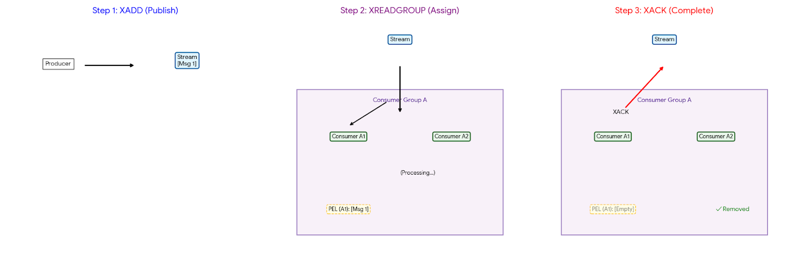

## 왜 Redis 인가?
Redis는 인메모리 데이터 


## Redis Client Graceful Shutdown
- Redis Client를 사용하는 애플리케이션을 종료할 때, Redis Client의 연결을 정상적으로 종료하는 것이 중요하다.
  - 만약 애플리케이션 종료 시점에 Redis Client의 연결이 강제로 종료되면, Redis 서버와의 연결이 비정상적으로 종료되거나, 요청한 데이터의 손실이 일어날 수 있다.
- Spring Data Data 에서 제공하는 LettuceConnectionFactory 는 애플리케이션 종료 시점에 Redis Client의 연결을 정상적으로 종료할 수 있도록 지원한다.
  - `LettuceConnectionFactory`는 Spring Bean의 `destroy` 메서드에서 해당 설정을 사용하여 연결을 종료한다. 즉 Spring Context가 Bean을 소멸시키는 시점에 해당 설정이 적용된다.
- Spring 에서는 많은 부분에서 Graceful Shutdown 을 지원하여, 빈이 소멸되기전에 작업을 최대한 마무리할 수 있도록 돕는다. 때문에 Redis Client의 연결 종료 오류가 발생하지 않을 확률이 높다.
  - 하지만 관련 오류가 발생하였을때, LettuceClientConfiguration 에서 Graceful Shutdown 설정을 조정하여 문제를 해결할 수 있다는 것을 알아두는 것이 좋다.

### LettuceClientConfiguration 에서 Graceful Shutdown 설정하기
```java
LettuceClientConfiguration clientConfiguration = LettuceClientConfiguration.builder()
        .shutdownQuietPeriod(Duration.ZERO)  // Shutdown 요청 대기 시간, 기본값: 0ms
        .shutdownTimeout(Duration.ofMillis(100))      // Shutdown 최대 대기 시간, 기본값: 100ms
        .build();
```
- `shutdownQuietPeriod`: 요청 대기 시간 설정
  - 해당 시간 동안 새로운 요청이 들어오지 않으면, 더이상 요청을 받지 않고 연결을 종료한다. 만약 새로운 요청이 들어오면, 다시 대기 시간을 초기화한다.
- `shutdownTimeout`: 최대 대기 시간 설정
  - 해당 시간 동안 연결 종료가 완료되지 않으면, 강제로 연결을 종료한다.


## 복제 지연(Replication Lag)으로 인한 데이터 불일치 문제 해결하기
- Redis Master-Slave 구조에서는 Master 노드에서 데이터가 변경되면 해당 변경 사항이 Slave 노드로 복제된다.
- Redis가 Master-Slave 구조를 지원하는 이유는 주로 읽기 성능 향상과 데이터 가용성 확보를 위함이다. 특히 읽기 작업이 많은 애플리케이션에서는 Slave 노드에서 읽기 작업을 수행함으로써 Master 노드의 부하를 줄일 수 있다.
- 하지만 Redis의 복제 방식은 비동기적으로 이루어지기 때문에, Slave 노드가 Master 노드의 최신 데이터를 즉시 반영하지 못하는 복제 지연이 발생할 수 있다.
- 때문에 데이터의 일관성이 중요한 애플리케이션에서 읽기 작업을 Slave 노드에서 수행할 경우, 복제 지연으로 인하여 잘못된 데이터를 읽어올 위험이 있다.
- 때문에 각 상황별로 적절한 읽기 노드 선택 전략을 수립하는 것이 중요하며, `LettuceConnectionFactory`는 이를 위하여 `ReadFrom` 설정을 제공한다.
  - 만약 데이터 일관성이 매우 중요한 애플리케이션이라면, 모든 읽기 작업을 Master 노드에서 수행하도록 설정하는 것이 좋다.
  - 반면에 읽기 성능이 더 중요하고, 약간의 데이터 불일치가 허용되는 경우에는 Slave 노드에서 읽기 작업을 수행하도록 설정할 수 있다.

### LettuceClientConfiguration에서 ReadFrom 설정하기
```java
LettuceClientConfiguration clientConfiguration = LettuceClientConfiguration.builder()
        .readFrom(ReadFrom.REPLICA_PREFERRED)  // 읽기 노드 선택 전략 설정
        .build();
```

- REPLICA_PREFERRED: 가능하면 Slave 노드에서 읽기 작업을 수행하고, Slave 노드가 사용 불가능한 경우에만 Master 노드에서 읽기 작업을 수행한다.
- ANY_PREFERRED: 가능하면 어떤 노드에서든 읽기 작업을 수행하고, Slave 노드가 사용이 불가하면 Master 노드에서 읽기 작업을 수행한다.
- UPSTREAM/MASTER: 항상 Master 노드에서 읽기 작업을 수행한다.
- 이외에도 다양한 읽기 노드 선택 전략이 존재한다. 각 전략의 특징과 사용 사례에 대해서는 아래 링크를 참고하자.

> https://redisgate.kr/redis/clients/springboot_readfrom.php
> https://github.com/redis/lettuce/wiki/ReadFrom-Settings


## Serialization
- Redis는 기본적으로 문자열 형태로 데이터를 저장한다.
    - 실제로는 바이트 코드로 저장되지만, 사람이 읽을 수 있는 형태로 표현하면 문자열이다. 바이트 코드는 다양한 데이터 타입을 표현할 수 있지만, ***일반적으로 Redis Client 라이브러리는 문자열로 인코딩/디코딩***한다.
- 따라서 객체를 다루는 애플리케이션에서는 객체를 그대로 Redis에 저장할 수 없고, 객체를 Redis가 이해할 수 있는 형식으로 변환해야 한다.
- 객체를 문자열로 변환하는 과정에서 가장 널리 사용되는 방법은 JSON 직렬화이다. JSON 직렬화는 객체를 JSON 문자열로 변환하여 저장하는 방식으로, 다양한 프로그래밍 언어에서 지원된다.
- Spring Data Redis에서는 다양한 직렬화/역직렬화 방식을 제공하며, `RedisSerializer` 인터페이스를 구현한 여러 클래스를 이용하여 직렬화/역직렬화를 수행하게 되며, `RedisTemplate`에서 이를 설정하여 사용할 수 있다. 

### 주요 RedisSerializer 종류

#### StringRedisSerializer
- 문자열을 그대로 저장한다. 주로 키(key)와 값(value)이 모두 문자열인 경우에 사용된다.
- 객체를 저장할때는 `toString()` 메서드를 호출하여 문자열로 변환한 후 직렬화한다. 때문에 객체의 필드 값을 직렬화하는 것이 아니라, 객체의 메모리 주소를 나타내는 문자열이 저장된다.

```java
StringRedisSerializer serializer = new StringRedisSerializer();
User userJsonType = new User("userJsonType", 10);

byte[] serialize = serializer.serialize(userJsonType.toString());

// serialize = org.example.springredisclient.RedisSerializerTest$User@389c4eb1
System.out.println("serialize = " + new String(serialize));
```

#### Jackson2JsonRedisSerializer
- Jackson 라이브러리를 사용하여 JSON 직렬화한다. 객체 생성시, 클래스 타입 정보를 셋팅해주어야 하며 지정된 클래스 타입으로만 직렬화/역직렬화가 가능하다.

```java
ObjectMapper objectMapper = new ObjectMapper();
Jackson2JsonRedisSerializer<User> serializer = new Jackson2JsonRedisSerializer<>(objectMapper, User.class);

User userJsonType = new User("userJsonType", 10);

byte[] serialize = serializer.serialize(userJsonType);
// serialize = {"name":"userJsonType","age":10}
System.out.println("serialize = " + new String(serialize));
```

- 하지만 정해진 클래스 타입으로만 직렬화/역직렬화가 가능하기 때문에, 다양한 클래스 타입의 객체를 저장해야 하는 경우에는 적합하지 않다.
- 예를 들어서 Spring 에서는 RedisTemplate을 빈으로 등록하고 이를 다양한 곳에서 주입받아 사용하는데, 이때 여러 종류의 객체를 저장해야 한다면 Jackson2JsonRedisSerializer는 적합하지 않다.

```java
ObjectMapper objectMapper = new ObjectMapper();
// 다양한 타입을 처리하기 위하여 Object.class 사용
Jackson2JsonRedisSerializer<Object> serializer = new Jackson2JsonRedisSerializer<>(objectMapper, Object.class);

User userJsonType = new User("userJsonType", 10);

byte[] serialize = serializer.serialize(userJsonType);
// 역직렬화 시 ClassCastException 발생
User deserialize = (User) serializer.deserialize(serialize);
```

위 코드에서 다양한 타입을 처리하기 위해서 Object.class를 사용하였지만, 역직렬화 시점에 ClassCastException이 발생한다. <br/>
이는 ObjectMapper가 역직렬화 시점에 클래스 타입 정보를 알 수 없기 때문에 Json 문자열을 LinkedHashMap으로 변환했기 때문이다. <br/> 
이로 인하여 User 타입으로 캐스팅할 수 없게 된다.

#### GenericJackson2JsonRedisSerializer

Jackson 라이브러리를 사용하여 JSON 직렬화한다. 직렬화시, 클래스 타입 정보를 함께 저장하여, 다양한 클래스 타입의 객체를 직렬화/역직렬화할 수 있다.

```java
// 내부적으로 ObjectMapper에서 DefaultTyping 설정을 사용
GenericJackson2JsonRedisSerializer serializer = new GenericJackson2JsonRedisSerializer();
serializer.configure(objectMapper -> {
    // 추가 설정 가능
});

User user = new User("user1", 10);

byte[] serialize = serializer.serialize(user);

// serialize = {"@class":"org.example.springredisclient.RedisSerializerTest$User","name":"user1","age":10}
System.out.println("serialize = " + new String(serialize));
```

역직렬화 시점에 `@class` 필드에 클래스 타입 정보를 함께 저장하기 때문에, 다양한 클래스 타입의 객체를 직렬화/역직렬화할 수 있다. <br/>
따라서 Spring 에서 RedisTemplate을 빈으로 등록하고, 이를 다양한 곳에서 주입받아 사용하는 경우에 적합하다. <br/>
하지만 몇가지 단점이 존재한다.
1. 리팩토링을 통해서 패키지 이동이나 클래스 이름 변경이 발생할 경우, 역직렬화가 실패할 수 있다. 
   - 예를 들어 `CacheManager`에서 `GenericJackson2JsonRedisSerializer`를 사용할 경우, 캐싱 대상이 되는 클래스 타입이나 패키지가 변경되면 역직렬화가 실패할 수 있다.
   - 이를 보완하기 위해서는 별도의 타입 매핑 전략을 수립하거나, 클래스 이름 변경 시점에 데이터 마이그레이션 작업이 필요하다.
2. 데이터의 크기가 커질 수 있다.
    - 클래스 타입 정보를 함께 저장하기 때문에, 직렬화된 데이터의 크기가 커질 수 있다. 이는 네트워크 전송 비용과 저장 공간에 영향을 미칠 수 있다.
3. Java 이외의 프로그램에서는 `@class` 필드를 해석할 수 없다.
    - 만약 Redis에 저장된 데이터를 Java 이외의 프로그램에서 읽어야 하는 경우, `@class` 필드를 해석할 수 없기 때문에 불필요한 정보가 포함된 JSON 데이터를 처리해야 한다.

만약 캐시 대상이 되는 클래스의 패키지 이동이나 클래스 이름 변경이 발생할 경우에는 어떻게 대처하는 것이 좋을까?
1. **타입 별칭 사용** <br/>
직렬화 시점에 클래스 타입 정보를 별칭(alias)으로 매핑하여 저장하는 방법이다. @JsonTypeInfo 어노테이션과 @JsonSubTypes 어노테이션을 사용하여, 클래스 타입 정보를 별칭으로 매핑할 수 있다. <br/>
참고로 위 어노테이션은 Json의 다형성(Polymorphism)을 지원하기 위한 어노테이션이다.
```java
    
GenericJackson2JsonRedisSerializer serializer = new GenericJackson2JsonRedisSerializer();

UserJsonType userJsonType = new UserJsonType("user1", 10);

byte[] serialize = serializer.serialize(userJsonType);
// serialize = {"@type":"user","name":"user1","age":10}
System.out.println("serialize = " + new String(serialize));

UserJsonType deserialize = serializer.deserialize(serialize, UserJsonType.class);
Assertions.assertEquals(UserJsonType.class, deserialize.getClass());

/**
 * @JsonTypeInfo와 @JsonSubTypes를 사용하여 @type 필드로 변경 및 값을 user로 지정
 */

@JsonTypeInfo(
    use = JsonTypeInfo.Id.NAME,
    include = JsonTypeInfo.As.PROPERTY
)
@JsonSubTypes({
        @JsonSubTypes.Type(value = UserJsonType.class, name = "user")
})
@Getter
public static class UserJsonType {
    private String name;
    private int age;

    public UserJsonType() {
    }

    public UserJsonType(String name, int age) {
        this.name = name;
        this.age = age;
    }
}
```
위 코드에서 어노테이션을 사용하여 `@type` 필드로 변경하고, 값을 `user`로 지정하였다. 이로 인해서 클래스의 이름이 변경되거나, 패키지가 이동하더라도, `@type` 필드와 값이 동일하다면 역직렬화가 정상적으로 수행된다. <br/>
이를 활용하여 운영 환경에서도 별칭이 변경되지 않는한 자유롭게 리팩토링이 가능하다. 또한 MSA 환경에서 다른 서비스 간에 동일한 별칭을 사용하여 데이터를 공유할 수 도 있다. <br/>
하지만 별칭이 중복되지 않도록 주의해야 하고, 쉽게 변경되지 않아야 하며, 별칭 관리에 대한 정책이 필요하다. 또한 MSA 환경에서 별칭을 공유하게 될경우 서비스 간의 강한 결합이 발생할 수 있다. <br/>

2. **데이터 마이그레이션** <br/>


> [망나니개발자 > 스프링이 제공하는 레디스 직렬화/역직렬화(Redis Serializer/Deserializer)의 종류와 한계](https://mangkyu.tistory.com/402)


## Redisson

Redisson은 Redis와 Valkey를 지원하는 Java 기반의 오픈소스 클라이언트 라이브러리이다. <br/>
Lettuce, Jedis와 같은 Redis 클라이언트 라이브러리와 유사항 기능을 제공하지만, Redis에서 기본적으로 제공해주지 않는 추가 기능들을 제공한다. <br/>

- 자바 컬렉션을 통해서 구현한 분산 컬렉션 구현체 제공 (예: RMap, RSet, RList 등..)
- 자바 동기화 도구를 통해서 구현한 분산 동기화 구현체 제공 (예: RLock, RReadWriteLock 등...)
- 자바 고수준 스레드 API를 통해 구현한 분산 ExecutorService 제공 (예: RExecutorService,  RScheduledExecutorService 등...)
- Redisson Pro를 통한 고급 기능 제공 (예: Data partitioning, Queues, Reliable Pub/Sub 등..)

자바와 동일한 인터페이스 및 스프링 통합 환경을 제공하며, 2개 이상의 분산 환경에서 ***Redis를 공유 자원으로 활용하여 다양한 분산 시스템을 구축할 수 있도록 돕는다.*** <br/>

### Distributed Lock
Redisson은 자바 Lock 인터페이스를 구현한 RLock 클래스를 제공하여, 분산 환경에서의 락(lock) 기능을 지원한다. <br/>
보통 애플리케이션 서버의 경우 고가용성을 위하여 단일 서버가 아닌 여러대의 서버로 구성되어 있는 경우가 많다. <br/>
이러한 환경에서 Java의 동기화 기법만으로는 원격 데이터베이스에 존재하는 공유 자원에 대한 동기화 문제를 해결할 수 없다. <br/>
Distributed Lock은 여러 애플리케이션 서버에서 동시에 접근하는 공유 자원에 대한 동기화 문제를 해결해주며, 자바와 동일한 인터페이스를 제공해준다는 큰 장점이 있다. <br/>

```java
// 스레드 100개가 동시에 Counter 증가 시도
int iter = 100;
Counter counter = new Counter();
Counter lockCounter = new Counter();

ArrayList<Thread> threads = new ArrayList<>();
ArrayList<Thread> lockThreads = new ArrayList<>();

for (int i = 0; i < iter; i++) {
    // Lock 없이 카운터 증가
    Thread thread = new Thread(() -> {
        try {
            Thread.sleep(100);
            counter.increment();
        } catch (InterruptedException e) {
            throw new RuntimeException(e);
        }

    });
    threads.add(thread);

    // Distributed Lock을 사용한 카운터 증가
    Thread lockThread = new Thread(() -> {

        try {
            RLock lock = redissonClient.getLock("lock");
            // Uses pub/sub channel to notify other threads across all Redisson instances waiting to acquire a lock.
            boolean isAcquired = lock.tryLock(100000, 1000, TimeUnit.MILLISECONDS);
            if (isAcquired) {
                try {
                    Thread.sleep(100);
                    lockCounter.increment();
                } finally {
                    if (lock.isLocked() && lock.isHeldByCurrentThread()) {
                        lock.unlock();
                    }
                }
            }

        } catch (InterruptedException e) {
            throw new RuntimeException(e);
        }

        lockThreads.add(new Thread(() -> {

        }));
    });
    lockThreads.add(lockThread);

}

for (int i = 0; i < iter; i++) {
    threads.get(i).start();
    lockThreads.get(i).start();
}

for (int i = 0; i < iter; i++) {
    threads.get(i).join();
    lockThreads.get(i).join();
}

// "count = 93"
System.out.println("count = " + counter.getCount());
// "lock count = 100"
System.out.println("lock count = " + lockCounter.getCount());
```

해당 코드는 100개의 스레드가 동시에 Counter 객체의 increment 메서드를 호출하여 카운터를 증가시키는 예제이다. <br/>
첫번째 카운터는 Distributed Lock을 사용하지 않고, 두번째 카운터는 Distributed Lock을 사용하여 카운터를 증가시킨다. <br/>
실행 결과를 보면 Distributed Lock을 사용하지 않은 카운터는 100이 아닌 93이 출력되는 반면, Distributed Lock을 사용한 카운터는 100이 출력되는 것을 확인할 수 있다. <br/>
이는 Distributed Lock을 사용하지 않은 경우, 여러 스레드가 동시에 공유 자원에 접근하여 동시성 이슈가 발생했기 때문이다. <br/>
반면에 Distributed Lock을 사용한 경우, 여러 스레드가 동시에 공유 자원에 접근하지 못하도록 막아주었기 때문에, 동시성 이슈가 발생하지 않았다. <br/>

#### Lock
- RLock은 Redis의 Pub/Sub 기능을 활용하여, 여러 애플리케이션 서버에서 동시에 접근하는 공유 자원에 대한 동기화 문제를 해결해준다.


#### ReadWriteLock


#### MuliLock


> [Redisson](https://redisson.pro/docs/overview/)
## Data Type

### String
key-value 쌍으로 데이터를 저장하는 가장 기본적인 데이터 타입이다. <br/>
최대 512MB까지 저장할 수 있으며, binery-safe 하기 때문에 문자열, 숫자, 바이너리, 이미지와 오디오같은 다양한 형태의 데이터를 저장할 수 있다.

#### 활용 방법
1. 캐싱: 자주 조회되는 데이터를 캐싱하여, 데이터베이스 부하를 줄이고 응답 속도를 향상시킨다. <br/>
2. 세션 관리: 웹 애플리케이션에서 사용자 세션 정보를 저장하는데 사용된다. <br/>
3. 카운터: 방문자 수, 좋아요 수, 요청 제한 등과 같은 간단한 카운터를 구현하는데 사용된다. <br/>
4. 중복 요청에 대한 단일 처리: SET NX 옵션을 사용하여, 중복 요청에 대한 단일 요청을 처리하는데 사용된다.
   - PUB/SUB 구조에서 메시지 처리 중복 방지
   - 웹훅 중복 처리 방지

### Bitmap
bit 단위로 데이터를 저장하는 데이터 타입으로써, 메모리 효율성이 뛰어나고, 빠른 속도로 대량의 데이터를 처리할 수 있다. <br/>
실제 데이터는 String 타입으로 저장되지만, 비트 연산을 지원하는 명령어들을 제공하여, 비트 단위로 데이터를 조작할 수 있다. <br/>
때문에 최대 512MB (2^32 -1 비트, 약 42.9억 비트)까지 저장할 수 있다.

#### 활용 방법
1. 플래그 저장: 사용/미사용, 활성화/비활성화 등과 같은 플래그 정보를 저장하는데 활용할 수 있다.
    - 쿠폰 사용 여부, 예약 여부, 기능 활성화 여부 등..
2. 통계 집계: `BITOP` 명령어를 사용하여 비트 연산(AND, OR, XOR, NOT)을 통해서, 교집합, 차집합, 합집합 등을 빠르게 계산할 수 있다.
   - 아래는 3일간 방문한 사용자중에 3일 모두 방문한 사용자를 구하는 예제이다. 참고로 BITOP 및 BITCOUNT 명령어는 `O(N)` 시간 복잡도를 가지기 때문에 너무 큰 비트맵에 대해서는 성능 저하가 발생할 수 있다.
```redis
-- 1일차 방문자
SETBIT visit:20260101 1 1
SETBIT visit:20260101 2 1
SETBIT visit:20260101 3 1

-- 2일차 방문자
SETBIT visit:20260102 1 1

-- 3일차 방문자
SETBIT visit:20260103 1 1

-- visit:duration:3days에 AND 연산자를 활용하여 3일간 방문한 사용자 비트맵 저장
BITOP AND visit:duration:3days visit:20260101 visit:20260102 visit:20260103

-- visit:duration:3days 비트맵에서 3일간 방문한 사용자 수 조회
BITCOUNT visit:duration:3days
```

### List
List는 순서를 가진 문자열 데이터 목록이며, 연결 리스트의 자료구조 특성을 가진다. <br/>
연결 리스트의 자료구조 특성 때문에, Stack(후입선출) 및 Queue(선입선출) 자료구조로 활용 가능 하며, 양쪽 끝에서의 삽입 및 삭제 연산이 빠른 대신에 인덱스를 이용한 접근 속도는 느리다. <br/>
최대 약 42.9억개의 요소를 저장할 수 있으며, 사이즈가 0이 되는 순간 레디스는 해당 키를 자동으로 삭제한다.

#### 활용 방법
1. 대기열 (Queue): 작업 대기열, 메시지 큐 등과 같은 대기열을 구현하는데 사용할 수 있다.
2. 제한된 크기를 가진 로그 저장: 최근 N개의 로그 메시지나 이벤트를 저장하는데 사용할 수 있다.
3. 스택 (Stack): 최근 본 상품 목록, 방문 기록 등과 같은 스택 자료구조를 구현하는데 사용할 수 있다.

### Hash
Hash는 필드-값 쌍으로 이루어진 데이터 구조로, 하나의 키에 여러 개의 필드와 값을 저장할 수 있다. <br/>
각 필드는 고유한 이름을 가지며, 필드 이름을 통해서 해당 필드의 값을 빠르게 조회할 수 있는 특징이 있다. <br/>
최대 약 42.9억개의 필드를 저장할 수 있으며, 사이즈가 0이 되는 순간 레디스는 해당 키를 자동으로 삭제한다. <br/>
또한 Redis 7.4.0 버전 이후부터는 각 field에 TTL 설정이 가능하다.

#### 활용 방법
1. 객체 저장: 객체로 표현되는 데이터를 저장하는데 사용할 수 있다. 예를 들어, 사용자 정보, 상품 정보 등을 저장할 수 있다.
2. 설정 관리: 애플리케이션 설정, 환경 변수 등과 같은 설정 정보를 저장하는데 사용할 수 있다.
3. 카운터: 여러 개의 카운터를 하나의 키에 저장하는데 사용할 수 있다.
4. 세션 관리: 사용자 세션 정보를 필드-값 쌍으로 저장하는데 사용할 수 있다.
5. 카테고리 및 태그 관리: 블로그 게시물, 상품 등과 같은 항목에 대한 카테고리 및 태그 정보를 저장하는데 사용할 수 있다.

### Set
Set은 중복되지 않는 문자열 데이터의 집합을 저장하는 데이터 타입이다. <br/>
집합의 특성 때문에, 요소의 추가, 삭제, 존재 여부 확인 등의 연산이 빠르며, 최대 약 42.9억개의 요소를 저장할 수 있다. <br/>
사이즈가 0이 되는 순간 레디스는 해당 키를 자동으로 삭제한다.

#### 활용 방법
1. 집합 연산: 교집합, 합집합, 차집합 등과 같은 집합 연산을 수행하는데 사용할 수 있다.
    - 집합 연산은 O(n)의 시간 복잡도를 가지기 때문에, 너무 큰 집합들에 대해서는 성능 저하가 발생할 수 있다.
2. 중복 데이터 관리: 중복되지 않는 데이터 목록을 관리하는데 사용할 수 있다.
   - 고유 방문자 목록, 좋아요를 누른 사용자, 즐겨찾기 목록 등을 통하여 중복 데이터를 자동으로 관리할 수 있다.
   - 블로그 게시물, 상품 등과 같은 항목에 대한 카테고리 및 태그 정보를 관리하는 용도로도 활용할 수 있다.


### Sorted Set
Sorted Set은 요소가 중복되지 않는 문자열 데이터(member)의 집합이며, 각 요소에 점수(score)를 부여하여 정렬된 상태로 저장하는 데이터 타입이다. <br/>
Sorted Set은 Set과 유사하지만, 각 요소에 점수를 부여하여 정렬된 상태로 저장한다는 점에서 차이가 있다. <br/>
member-score 형식의 구조를 가지고 있으며 score는 중복될 수 있지만, member는 중복될 수 없다. <br/>
Sorted Set은 List와 Set의 속성을 둘다 가지고 있기 때문에 비슷한 명령어를 수행할 수 있는 장점이 있다.

#### 활용 방법
1. 리더보드 및 실시간 순위: 게임 점수, 랭킹 등과 같은 리더보드를 구현하는데 사용할 수 있다. 
2. Sliding-Window Rate Limiter: "최근 5분동안 100회 이상 요청 불가"와 같은 Sliding-Window Rate Limiter를 구현하는데 사용할 수 있다.
3. 우선순위 큐: 메시지 큐에 우선순위를 부여하여, 우선순위에 따라 메시지를 처리하는 우선순위 큐를 구현하는데 사용할 수 있다.
   - Sorted Set을 이용하여 특정 이벤트를 처리하는 도중 급하게 처리해야할 이벤트가 발생했을때, 우선순위를 높여서 빠르게 처리할 수 있다.
4. 타임라인: timestamp를 score로 사용하여, 사용자 활동 기록이나 예약 일정 등을 시간 순서대로 정렬하여 저장하는데 사용할 수 있다.


### Time Series

### Geospatial


## Redis Messaging Service

### Stream
Redis Stream은 Redis 5.0 버전에서 도입된 데이터 타입으로, 로그성 데이터와 비슷하게 데이터를 삭제하거나 변경하지 않고 순차적으로 추가되는 데이터를 저장하고 처리하는데 최적화된 데이터 구조이다. <br/>
Stream은 메시지 큐와 유사한 기능을 제공하지만, 메시지 큐와 다르게 ***데이터를 삭제하지 않고, 데이터를 보존***하기 때문에, 이를 활용하여 저장된 메시지를 다시 재활용이 가능하다. <br/>
또한 PEL&ACK를 이용하여 ***메시지를 안전하게 처리***할 수 잇으며, Consumer Group 기능을 제공하여, 여러 Consumer들이 ***병렬로 메시지를 처리***할 수 있고, Redis Stream은 Kafka의 Partition이란 개념이 없기 때문에, ***메시지가 들어온 순서대로 처리***된다. 





#### 구성 요소
1. Entry ID (Unique Id): 각 메시지는 `<millisecondsTime>-<sequenceNumber>` 형식의 고유한 ID를 가진다.
- millisecondsTime: 메시지가 추가된 시간(밀리초 단위)
- sequenceNumber: 동일한 밀리초 내에서의 순서 번호

2. Consumer Group: Stream에 저장된 메시지를 여러 소비자(Consumer)들이 병렬로 처리할 수 있다.
- 각 Consumer Group은 독립적인 오프셋(읽기 위치)를 가지며, 소비자 그룹에 속한 소비자는 서로 다른 메시지를 처리할 수 있다.
- 예를 들어 '주문 완료'라는 Stream이 있다고 가정할 때, '알림 소비자 그룹' 및 '예약 소비자 그룹'이 동일한 메시지를 읽어들여 각각의 작업을 수행할 수 있다. 
- 각기 다른 오프셋을 가질 수 있는 이유는 Redis가 각 Consumer Group마다 별도의 읽기 위치를 관리하기 때문이다. (Consumer Group 메타 데이터 관리)

3. PEL(Pending Entries List) & ACK(Acknowledgement): 소비자가 메시지를 처리한 후, 해당 메시지에 대한 ACK를 보내어 메시지가 성공적으로 처리되었음을 알린다.
- PEL은 아직 ACK되지 않은 메시지들의 목록을 관리하며, 소비자가 메시지를 처리한 후 ACK를 보내면 해당 메시지는 PEL에서 제거된다.
> Traditionally, when a consumer processesed a message, it acknowledged it using the XACK command, which removed the entry reference from the Pending Entries List (PEL) of that specific consumer group.
- 소비자는 각각의 PEL을 가지며, 메시지를 처리한 후 ACK를 보내지 않으면, 해당 메시지는 PEL에 남아있게 된다.

#### Stream 사용해보기

1. **컨슈머 그룹 생성 및 메타데이터 확인** <br/>
```redis
-- order:complete stream의 컨슈머 그룹 생성, NotificationConsumerGroup, BookingConsumerGroup
-- $는 스트림의 마지막 ID 이후를 의미 , XINFO STREAM 명령어에서 last-generated-id 값 이후에 메시지를 읽음, id가 0이면 스트림의 처음부터 메시지를 읽음
-- MKSTREAM 옵션은 스트림이 존재하지 않을 경우 스트림을 생성
XGROUP CREATE order:complete NotificationConsumerGroup $ MKSTREAM
XGROUP CREATE order:complete BookingConsumerGroup $ MKSTREAM

-- order:complete 스트림의 컨슈머 그룹 메타 데이터 정보 확인
XINFO GROUPS order:complete
+-------------------------+---------+-------+-----------------+
|name                     |consumers|pending|last-delivered-id|
+-------------------------+---------+-------+-----------------+
|BookingConsumerGroup     |0        |0      |0-0              |
|NotificationConsumerGroup|0        |0      |0-0              |
+-------------------------+---------+-------+-----------------+
```
먼저 order:complete 스트림에 NotificationConsumerGroup 및 BookingConsumerGroup이라는 두개의 소비자 그룹을 생성한다. <br/>
각 그룹은 스트림의 `마지막 ID 이후($)부터 메시지를 읽기` 시작하며, 스트림이 존재하지 않을 경우 컨슈머 그룹 생성시 에러를 방지하기 위하여 `MKSTREAM` 옵션을 통해 스트림을 생성한다. <br/>
만약 id가 0이면 스트림의 처음부터 메시지를 읽게 된다. <br/>
메타 데이터 정보를 확인해보면, 각 그룹의 소비자 수(consumers), PEL에 남아있는 메시지 수(pending), 마지막으로 전달된 메시지 ID(last-delivered-id)를 확인할 수 있다. <br/>


2. **스트림에 메시지 발행 및 컨슈머 그룹에서 메시지 읽기** <br/>
```redis
-- order:complete 스트림에 메시지 발행
XADD order:complete * orderId 1
-- order:complete 스트림의 메시지 확인
XRANGE order:complete - + count 10
-- order:complete 스트림의 메타 데이터 정보 확인
XINFO STREAM order:complete
+------+---------------+----------------+------+-----------------+-----------------------------------------------------+-----------------------------------------------------+
|length|radix-tree-keys|radix-tree-nodes|groups|last-generated-id|first-entry                                          |last-entry                                           |
+------+---------------+----------------+------+-----------------+-----------------------------------------------------+-----------------------------------------------------+
|1     |1              |2               |2     |1769945775499-0  |{"id": "1769945775499-0", "fields": {"orderId": "1"}}|{"id": "1769945775499-0", "fields": {"orderId": "1"}}|
+------+---------------+----------------+------+-----------------+-----------------------------------------------------+-----------------------------------------------------+

```
`XADD` 명령어를 통해서 스트림에 메시지를 발행한 이후에, `XRANGE` 명령어를 통해서 스트림에 저장된 메시지를 확인할 수 있다. <br/>
메타 데이터 정보를 확인해보면 `last-generated-id`를 통해서 마지막으로 발행된 메시지 ID를 확인할 수 있으며, `length`를 통해서 스트림에 저장된 메시지 수를 확인할 수 있다. <br/>

3. **컨슈머 그룹에서 메시지 읽기 및 PEL 확인** <br/>
```redis
-- NotificationConsumerGroup 컨슈머 그룹의 NotificationConsumer1, NotificationConsumer2 컨슈머가 각각 order:complete 스트림에서 메시지를 읽음
-- NotificationConsumer1이 먼저 메시지를 읽어 들였기 때문에 NotificationConsumer2는 읽을 메시지가 없음
XREADGROUP GROUP NotificationConsumerGroup NotificationConsumer1 COUNT 1 STREAMS order:complete >
XREADGROUP GROUP NotificationConsumerGroup NotificationConsumer2 COUNT 1 STREAMS order:complete >
-- BookingConsumerGroup 컨슈머 그룹의 BookingConsumer1 컨슈머가 order:complete 스트림에서 메시지를 읽음
XREADGROUP GROUP BookingConsumerGroup BookingConsumer1 COUNT 1 STREAMS order:complete >

-- 컨슈머 그룹의 메타데이터 확인
XINFO GROUPS order:complete
+-------------------------+---------+-------+-----------------+
|name                     |consumers|pending|last-delivered-id|
+-------------------------+---------+-------+-----------------+
|BookingConsumerGroup     |1        |1      |1769945775499-0  |
|NotificationConsumerGroup|2        |1      |1769945775499-0  |
+-------------------------+---------+-------+-----------------+

XPENDING order:complete NotificationConsumerGroup
XPENDING order:complete NotificationConsumerGroup - + 10 NotificationConsumer1
+---------------+---------------------+---------+---------------+
|id             |consumer-name        |idle-time|delivered-times|
+---------------+---------------------+---------+---------------+
|1769945775499-0|NotificationConsumer1|349036   |1              |
+---------------+---------------------+---------+---------------+
```
`XREADGROUP` 명령어를 통해서 각 컨슈머 그룹의 컨슈머들이 스트림에서 메시지를 읽어들인다. <br/>
NotificationConsumerGroup 컨슈머 그룹은 2개의 컨슈머가 존재하지만, 메시지는 1개만 발행되었기 때문에 NotificationConsumer1 컨슈머만 메시지를 읽어들일 수 있다. <br/>
BookingConsumerGroup 컨슈머 그룹은 NotificationConsumerGroup과 다른 오프셋을 가지기 때문에, BookingConsumer1 컨슈머가 메시지를 읽어들일 수 있다. <br/>
`XINFO GROUPS`의 메타데이터를 확인해보면, 각 그룹의 소비자 수(consumers), PEL에 남아있는 메시지 수(pending), 마지막으로 전달된 메시지 ID(last-delivered-id)를 확인할 수 있다. <br/>
`XPENDING` 명령어를 통해서 NotificationConsumerGroup 컨슈머 그룹의 PEL에 남아있는 메시지 목록을 확인할 수 있다. 내부 메타데이터 중에 `idle-time`은 메시지가 읽혀진 이후로부터 경과된 시간을 밀리초 단위로 나타낸다. 즉 `idle-time`이 크다는 의미는 오랫동안 메시지 처리가 정상적으로 이루어 지지 않아다는 것을 의미한다. <br/>
때문에 애플리케이션 레벨에서 `idle-time`이 일정 시간 이상 경과된 메시지에 대해서는 재처리를 수행하는 로직을 구현하는 것이 좋다. <br/>

4. **메시지 처리 완료 및 PEL에서 제거** <br/>
```redis
-- 메시지 처리 완료 후 ACK 명령어를 통해서 PEL에서 제거, 즉 소비자가 정상적으로 메시지를 처리했음을 알림
XACK order:complete NotificationConsumerGroup 1769945775499-0
XACK order:complete BookingConsumerGroup 1769945775499-0

-- pending count가 0으로 변경되었는지 확인
XINFO GROUPS order:complete

-- PEL이 비어있는지 확인
XPENDING order:complete NotificationConsumerGroup - + 10 NotificationConsumer1
XPENDING order:complete BookingConsumerGroup - + 10 BookingConsumer1
```

메시지 처리가 완료된 후에는 `XACK` 명령어를 통해서 PEL에서 해당 메시지를 제거한다. 이는 소비자가 정상적으로 메시지를 처리했음을 알리는 것이다. <br/>
`XINFO GROUPS` 명령어를 통해서 pending count가 0으로 변경되었는지 확인할 수 있으며, `XPENDING` 명령어를 통해서 PEL이 비어있는지 확인할 수 있다. <br/>

#### Stream 사용시 주의사항
1. **Stream 크기 관리 필요성** <br/>
Redis Stream은 데이터를 삭제하지 않고 보존하기 때문에, 시간이 지남에 따라 스트림의 크기가 계속해서 증가할 수 있다. <br/>
Kafka와 같이 하드디스크에 데이터를 저장하는 시스템과 다르게, Redis는 메모리 기반의 데이터 저장소이기 때문에, ***스트림의 크기가 커지면 메모리 부족 현상이 발생***할 수 있다. <br/>
따라서 데이터를 추가하는 시점(`XADD ... [<MAXLEN | MINID> [= | ~] threshold [LIMIT count]]`)이나, 주기적인 백그라운드 작업(`XTRIM`)을 통해서 스트림의 크기를 관리하는 것이 중요하다. <br/><br/>

2. **PEL 관리의 필요성** <br/>
PEL은 아직 ACK되지 않은 메시지들의 목록을 관리하기 때문에, 시간이 지남에 따라 PEL의 크기가 계속해서 증가할 수 있다. <br/>
PEL의 크기가 커진다는 의미는 소비자가 메시지를 정상적으로 처리하지 못하고 있다는 것을 의미이기도 하며, Redis의 메모리 사용량이 증가한다는 의미이기도 하다. <br/>
따라서 애플리케이션 레벨에서 `XPENDING` 명령어를 통해서 PEL의 상태를 주기적으로 모니터링하고, `idle-time`이 일정 시간 이상 경과된 메시지에 대해서는 재처리를 수행하는 로직을 구현하는 것이 좋다. <br/><br/>

3. **Auto Scailing시 주의 사항** <br/>
오토 스케일링 환경에서의 애플리케이션에서 Redis Stream을 사용할 때, 컨슈머 그룹의 컨슈머 수가 동적으로 변경될 수 있다. <br/>
컨슈머가 증가하게 되는 경우 컨슈머 이름만 고유하면 되기 때문에 큰 문제가 없지만, 컨슈머가 감소하게 되는 경우에는 PEL에 남아있는 메시지들이 처리되지 못할 수 있다. <br/>
따라서 오토 스케일링 환경에서 Redis Stream을 사용할 때, 특히 스케일 인 시점에 PEL에 남아있는 메시지들을 적절히 처리할 수 있는 로직을 구현하는 것이 중요하다. <br/>
Graceful Shutdown을 이용하여 시점에 메시지 수신을 중지(pull 중지)하고, PEL에 남아있는 메시지들을 모두 처리한 이후(남은 로직 수행)에 컨슈머를 종료(`XGROUP DELCONSUMER`)하는 방법이 있다. <br/>
아니면 PEL에 남아있는 메시지들을 다른 컨슈머에게 재할당(`XCLAIM`)하는 방법도 있다. <br/><br/>

4. **클러스터 환경에서 Stream 파티셔닝 주의사항** <br/>
Kafka는 하나의 토픽이 여러 파티션으로 나누어져 있기 때문에, 여러 브로커에 걸쳐서 데이터가 분산 저장된다. <br/>
하지만 Redis Stream은 특정 노드에게만 데이터가 집중될 수 있기 때문에, 성능 증대를 위해서 파티셔닝을 하고자 한다면 해시 슬롯을 고려하여 직접 개발(수동 파티셔닝)을 해야한다. <br/>
하지만 파티셔닝을 하게 될 경우 Redis Stream의 메시지 순서 보장이 깨질 수 있기 때문에 이를 고려하여 설계해야 한다. <br/><br/>


> [Gmarket > Redis Stream 적용기](https://dev.gmarket.com/113) <br/>
> [Redis Docs > Streams](https://redis.io/docs/latest/develop/data-types/streams)

### Redis Pub/Sub
Redis는 데이터 타입 외에도 다양한 기능을 제공하며, 그 중 하나가 Pub/Sub 기능이다. <br/>
PUB/SUB는 발행자-구독자 모델을 기반으로 하는 메시징 시스템으로, 발행자가 특정 채널에 메시지를 발행하면 해당 채널을 구독하고 있는 구독자들이 메시지를 수신하는 방식이다. <br/>
Redis의 Pub/Sub은 최대 한번의 전달(At-Most-Once Delivery) 방식을 사용하며, 만약 구독자가 ***네트워크 장애나 오류로 인하여 메시지를 수신하지 못하는 경우에는 메시지가 손실***될 수 있다. <br/>
즉, 메시지 브로커(RabbitMQ, Kafka 메시지 보존이, 재전송)와 같은 정교한 메시징 시스템과는 다르게, Redis Pub/Sub은 ***단순한 메시지 전달 기능만을 제공***한다. <br/>
때문에 ***메시지 손실이 일어나지 않아야하며 정합성이 중요한 애플리케이션의 경우에는 Redis Pub/Sub을 사용하는 것이 적합하지 않을 수 있다.*** <br/>


> https://redis.io/docs/latest/develop/pubsub/


### PUB/SUB

레디스는 PUB/SUB 기능을 재공하며, 특정 레디스 노드에서 채널을 통해서 메시지를 발행하면 해당 채널을 구독하고 있는 레디스 노드가 메시지를 읽을 수 있다. <br/>
최소한의 메시지 기능만 전달기능만 제공하기 때문에, 정상적으로 모든 구독자에게 메시지가 전달되었는지는 확인할 수 없다. 구독자 또한 메시지를 어떤 발행자에 의해서 전달되는지에 대한 메타데이터 정보를 알 수 없다. <br/>
때문에 정합성이 중요한 데이터를 전달하기에는 적합하지 않을 수 있으며, 정합성이 중요하지 않고 오류를 고려할 필요가 없는 작업(로깅, 통계)에 사용하는 것이 좋다. <br/>


## 모니터링 및 관리


## 복원

## 