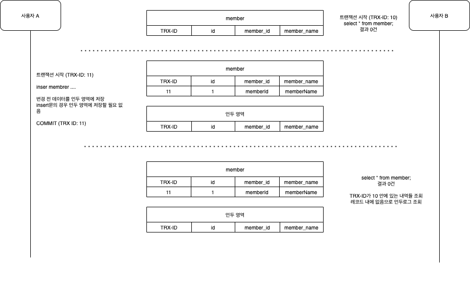

### 1. 트랜잭션 격리 수준

---

- 트랜잭션 격리 수준이란 트랜잭션이 동시에 처리될 때, ***특정 트랜잭션이 다른 트랜잭션에서 변경하거나 조회하는 데이터를 볼 수 있게 허용할지 말지를 결정***하는 것이다.
- 격리 수준에 따라서 4가지 정도 분류가 된다. 순서가 밑에 있을 수록 격리 수준이 높다.
  - READ UNCOMMITED
  - READ COMMITTED
  - REPEATABLE READ
  - SERIALIZABLE


### 2. READ UNCOMMITED

---

- READ UNCOMMITED란 더티 리드(Dirty Read)가 허용되어 있는 격리 수준이다.
    > 더티 리드란 트랜잭션에서 처리한 작업이 완료되지 않은 상태에서도 다른 트랜잭션에서 해당 데이터를 조회할 수 있다.
- 트랜잭션이 완료되지 않은 상태란 commit, rollback 명령어가 실행되기 전의 상태를 의미한다.
- 즉 문제가 발생하여 rollback이 되어야 할 때, rollback 명령어가 실행되기 전이라면 READ UNCOMMITTED 격리 수준이라면 해당 데이터를 읽어 들일 수 있다.
  - 이는 데이터 정합성의 문제가 발생함으로 인해서 잘 사용되지 않는다.
  - 왠만한 경우가 아니고서야 READ COMMITTED 이상의 격리수준을 사용하기를 권장한다.

#### 2.1. Dirty Read 체험해보기

1. 회원 테이블 생성
    ```sql
    create table member (
        id int not null primary key,
        member_id varchar(20) not null,
        member_name varchar(20) not null
    );
    ```
2. 세션A table에 insert 작업 이후 10초 동안 sleep한 이후 트랜잭션 종료
    ```sql
    set session autocommit = false;
    start transaction;

    -- 트랜잭션 격리 수준 확인, 디폴트는 REPEATABLE READ
    SELECT @@tx_isolation;

    insert into member values (1, 'memberId1', 'memberName1');

    -- 세션B에서 해당 데이터를 읽을 수 있는지 확인하기 위하여 sleep문 작성
    do sleep(10);

    commit;
    ```
3. 세션B는 세션A의 트랜잭션이 완료되기 전에 데이터를 읽을 수 있는지 확인
    ```sql
    set session autocommit = false;
    set session transaction isolation level READ UNCOMMITTED;
    start transaction;

    -- 트랜잭션 격리 수준 확인
    SELECT @@tx_isolation;

    select * from member;

    commit;
    ```

### 3. READ COMMITED

---

- READ COMMITED 격리 수준에서는 더티 리드가 발생하지 않는다.
  - 어떤 트랜잭션에서 데이터를 변경했어도 commit이 완료된 데이터만 다른 트랜잭션에서 조회할 수 있다.
- 하지만 READ COMMITED 격리 수준에서도 Non-Repeatable Read라는 부정합의 문제가 발생한다.
  - 하나의 트랜잭션에서 동일한 결과값을 보장하지 않는다는 의미이다.
  - 예를 들어 보자면 이러한 문제가 발생한다.
    1. A트랜잭션에서 select 문을 실행하였다.
    2. A트랜잭션에서 결과 값을 얻을 수 없었다.
    3. B트랜잭션에서 insert문을 통해서 데이터를 삽입하였다.
    4. A트랜잭션에서 동일한 테이블에서 select 문을 실행하였다.
    5. A트랜잭션에서 결과 값을 얻을 수 있었다.
    6. A,B 모두 트랜잭션이 종료되었다.
  - 위 예제에서 A트랜잭션은 동일 테이블을 두번 조회하였는데 첫 번째 select 문은 데이터가 존재하지 않았고, 두 번째 select문은 데이터가 존재하였다.
  - 하나의 트랜잭션 내에서 똑같은 select쿼리를 실행시켰을 때, 항상 동일한 결과값을 가져와야 한다는 REPEATABLE READ 정합성에 어긋난다.
- 웹 프로그램 수준에서는 크게 문제될 일은 없지만 동일 데이터를 여러 번 읽고 변경하는 작업이 금전적인 처리와 연결되면 문제가 될 수도 있다.
  - 이러한 문제가 발생하였을때 가장 큰 문제는 애플리케이션 내에서 버그가 발생하였을 때 문제를 파악하기가 쉽지 않다.

#### 3.1. Non-Repeatable Read 체험해보기

1. 회원 테이블 생성
    ```sql
    create table member (
        id int not null primary key,
        member_id varchar(20) not null,
        member_name varchar(20) not null
    );
    ```
2. 세션 A에서 member 테이블 조회한 이후 10초 기다리고 다시 member 테이블 조회해보기 
    ```sql
    set session autocommit = false;
    set session transaction isolation level READ COMMITTED;
    start transaction;

    -- 트랜잭션 격리 수준 확인
    SELECT @@tx_isolation;

    -- 동일 트랜잭션인데 데이터가 존재하지 않음
    select * from member;

    -- Non-Repeatable Read 문제를 확인하기 위하여 sleep
    do sleep(10);

    -- 동일 트랜잭션인데 데이터가 존재함
    select * from member;

    commit;
    ```
3. 세션B는 세션A의 트랜잭션이 완료되기 전에 데이터 삽입하기
    ```sql
    set session autocommit = false;
    start transaction;

    SELECT @@tx_isolation;

    insert into member values (1, 'memberId1', 'memberName1');

    commit;
    ```

### 4. REPEATABLE READ

---

- 일반적으로 DBMS는 ***하나의 트랜잭션이 진행되는 동안 데이터 변경 전/후에 대한 백업 공간***을 둔다.
  - 이러한 백업 공간을 언두 영역이라고한다.
  - 언두 영역을 두는 이유는 바로 데이터 정합성을 위한 것이다.
    - 물론 언두 영역이 단순히 트랜잭션의 데이터 정합성을 위해서만 사용하지 않는다.
    - 롤백의 경우 레코드를 다시 원복 시키기 위하여 언두 영역에서 이전 데이터를 가져온다. 
  - 아까 READ COMMIT 격리 수준에서 처음 select에서는 데이터가 존재하지 않았다가, 중간에 데이터가 삽입되었을 때, 두번째 select에서는 데이터가 나오는 Non-Repeatable Read가 발생하였다.
- REPEATABLE READ 격리 수준에서는 언두 영역의 데이터들 덕분에 Non-Repeatable Read가 발생하지 않는다.

#### 4.1. REPEATABLE READ 격리 수준에서 Non-Repeatable Read가 발생하지 않는지 확인해보기

- 아래의 SQL 문을 각기 다른 세션에서 순차적으로 실행하다 보면 실제로 Non-Repeatable Read가 발생하지 않는지 확인할 수 있다.

1. 회원 테이블 생성
    ```sql
    create table member (
        id int not null primary key,
        member_id varchar(20) not null,
        member_name varchar(20) not null
    );
    ```

2. Non-Repeatable Read가 발생하지 않는지 확인
    ```sql
    set session autocommit = false;
    set session transaction isolation level REPEATABLE READ;
    start transaction;

    -- 트랜잭션 격리 수준 확인
    SELECT @@tx_isolation;

    -- 데이터가 존재하지 않음
    select * from member;

    -- Non-Repeatable Read 문제가 안일어나는지 확인하기 위하여 sleep
    do sleep(10);

    -- 데이터가 삽입되었어도 동일한 결과를 얻기 위해서 언두 로그에서 조회
    select * from member;

    commit;
    ```
3. 첫번째 select문 실행 이후 insert 작업 진행
    ```sql
    set session autocommit = false;
    start transaction;

    SELECT @@tx_isolation;

    insert into member values (1, 'memberId1', 'memberName1');

    commit;
    ```

#### 4.2. REPEATABLE READ 격리 수준에서 왜 Non-Repeatable Read가 발생하지 않을까?



- 사용자 B가 member 테이블에서 회원을 조회한다.
- 사용자 B의 트랜잭션이 종료되기 전에 사용자 A가 데이터를 삽입하였다.
  - 데이터를 삽입하는 순간 테이블에 데이터에는 삽입되지만, 언두 로그에는 변경 전 데이터를 저장하기 위하여 아무 기록도 하지 않았다.
- 사용자 A의 트랜잭션이 종료된 이후, member 테이블에서 회원을 다시 한번 조회한다.
  - member 테이블에서 레코드를 조회하였을때 사용자 B의 TRX-ID(10) 이내의 트랜잭션이 없다.
  - 때문에 언두 영역에서 데이터를 조회한다.
- ***REPEATABLE READ는 트랜잭션 번호를 조회하여 먼저 실행된 트랜잭션의 데이터만 조회***한다.
- ***테이블 레코드에 먼저 실행된 트랜잭션 데이터가 존재하지 않는다면 언두 로그에서 데이터를 조회***한다.
- 


> Real MySql 8.0 개발자와 DBA를 위한 MySQL 실전 가이드, 백은비,이성욱, P176-183 <br/>
> https://mangkyu.tistory.com/299 <br/>
> https://mangkyu.tistory.com/300 <br/>