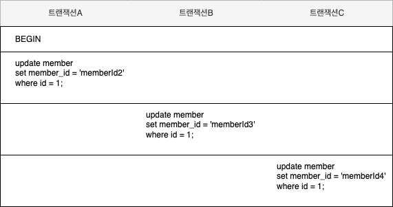

### 잠금
- 데이터베이스의 잠금 기능은 동시성을 제어하기 위한 기능이다.
- 하나의 레코드를 여러 커넥션에서 동시에 접근하여 변경하려고 할 때, 잠금이 없다면 하나의 데이터를 여러 커넥션이 동시에 변경할 수 있다.
  - 레코드의 값을 예측할 수 없는 상태가 된다.
- 잠금은 여러 커넥션에서 동시에 요청할 경우, 순서대로 한 시점에 하나의 커넥션만 데이터를 변경할 수 있게 해주는 역할을 한다.  


### InnoDB 스토리지 엔진 잠금

- InnoDB 스토리지 엔진 내부에서 레코드 기반의 잠금 방식을 탑재하고 있다.
  - 이러한 레코드 기반 장금 방식 때문에 훨씬 뛰어난 동시성 처리를 제공할 수 있다.
- `information_schema` 데이터베이스에 존재하는 `INNODB_TRX, INNODB_LOCKS, INNODB_LOCK_WAITS` 테이블을 통해서 현재 트랜잭션의 잠금 상태를 확인할 수 있다. 
  - 현재 어떤 트랜잭션이 어떤 잠금을 대기하는지 확인 가능
  - 해당 잠금을 어느 트랜잭션이 가지고 있는지 확인 가능
  - 장시간 잠금을 가지고 있는 클라이언트를 찾아서 종료도 가능 

### 레코드 락 (Record Lock)
- 레코드 자체만을 잠그는 것을 레코드 락이라고 하며, 다른 상용 DBMS의 레코드 락과 동일한 역할을 한다.
- InnoDB 스토리지 엔진은 ***레코드 자체가 아니라 인덱스의 레코드를 잠근다는점이 다른 사용 DBMS와 조금 다른 점***이다.
- 인덱스가 없는 테이블이더라도 내부적으로 자동 생성된 클러스터 인덱스를 이용해 잠금을 설정한다.
- ***프라이머리 키 또는 유니크 인덱스에 의한 변경 작업에서는 레코드 자체에 대해서만 락***을 건다.

#### InnoDB 인덱스 잠금
- InnoDB의 잠금 방식은 레코드를 잠그는 것이 아닌, 인덱스를 잠그는 방식으로 처리된다.
- 인덱스를 잠그는 방식이기 때문에 ***조건을 통해서 데이터를 변경할 때 해당 인덱스에 포함되어 있는 모든 레코드를 잠그게 된다.***
- 때문에 한 세션에서 UPDATE 작업을 하는 중에는 다른 클라이언트는 그 테이블을 업데이트 하지 못하고 기다려야하는 상황이 발생할 수 있다.
  - 때문에 데이터의 중복이 많은 컬러의 경우에는 굳이 인덱스를 걸지 않는 것이 좋다. 
- 테이블에 인덱스가 없다면 어떻게 될까?
  - 이러한 경우 테이블을 풀 스캔하면서 UPDATE 작업을 하는데, 이 과정에서 테이블에 있는 모든 레코드를 잠그게 된다.


### 자동 증가 락 (Auto Increment Lock)
- 자동 증가하는 숫자 값을 추출(채번)하기 위해서 AUTO_INCREMENT라는 컬럼 속성을 제공한다.
  - AUTO_INCREMENT 컬럼이 사용된 테이블에서 동시에 여러 레코드가 INSERT되는 경우, 저장되는 각 레코드는 중복되지 않고 저장된 순서대로 증가하는 일련 번호 값을 가져아한다.
- InnoDB 스토리지 엔진에서는 이를 위해 내부적으로 자동 증가 락이라고 하는 테이블 수준의 잠금을 사용한다.
- INSERT와 REPLACE 쿼리 문장과 같이 새로운 레코드를 저장하는 쿼리에서만 자동 증가 락이 걸린다.
  - UPDATE나 DELETE 등의 쿼리에서는 걸리지 않는다.
- INSERT를 동시에 실행되는 경우, 하나의 쿼리가 자동 증가 락을 걸면 나머지 쿼리는 자동 증가 락을 기다려야한다.
- AUTO_INCREMENT 락은 아주 짧은 시간동안 걸력다가 해제되기 때문에 대부분의 경우 문제가 되지 않는다.
- innodb_autoinc_lock_mode라는 시스템 변수를 이용해 자동 증가 락의 작동 방식을 변경할 수 있다.
  - innodb_autoinc_lock_mode = 0
    - 새로운 레코드를 저장하는 쿼리에서는 자동 증가 락을 사용한다.
  - innodb_autoinc_lock_mode = 1 
    - INSERT하는 레코드 건수를 정확히 예측할 수 있을 때는 자동 증가 락을 사용하지 않고, 경량화된 래치(뮤텍스)를 사용한다.
    - INSERT .... SELECT와 같이 MySQL 서버가 건수를 예측할 수 없을 때는 자동 증가락을 사용한다.
    - 이 때는 다른 커넥션에서는 INSERT를 실행하지 못하고 대기하게 된다. 
  - innodb_autoinc_lock_mode = 2
    - 자동 증가 락을 걸지 않고 경량화된 래치(뮤텍스)를 사용한다.
    - 때문에 동시 처리 성능이 높아지지만 유니크한 값이 생성된다는 것만 보장하며 연속된 자동 증가 값을 보장하지 않는다.
    - 예를 들어 INSERT .... SELECT 와 같이 대량 INSERT 문장이 실행되는 중에도 다른 커넥션에서 INSERT를 수행할 수 있기 때문에 연속된 자동 증가 값을 보장하지 않는다.


### 갭락(Gap Lock)
- 갭 락은 레코드 자체가 아니라 레코드와 바로 인접한 레코드 사이의 간격만을 잠그는 것을 의미한다.
- 갭 락의 역할은 레코드와 레코드 사이의 간격에 새로운 레코드가 생성되는 것을 제어한다.

### 넥스트 키 락 (Next Key Lock)
- 레코드 락과 갭 락을 합쳐 놓은 형태의 잠금을 넥스트 키 락이라고 한다.
- 마스터 서버에서 실행된 쿼리가 레플리카 서버에서 실행될 때 동일한 결과를 만들어내도록 보장하느 것이 주 목적이다.


 

### 레코드 수준의 잠금 확인 및 해제
- 레코드 수준의 잠금은 테이블의 레코드 각각에 잠금이 걸리므로 그 레코드가 자주 사용되지 않는다면 오랜 시간 동안 잠겨진 상태로 남아 있어 잘 발견되지 않는다.
- MariaDB, MySQL에서는 레코드 잠금에 대한 메타 정보를 제공하고 있기 때문에 쿼리를 통해서 확인할 수 있다.
- 프로세스를 강제로 종료할 수 있는 명령어인 `KILL` 명령어를 사용하면 강제로 잠금을 해제할 수 있다.

#### 레코드 잠금을 직접 확인해보기

```sql
-- 테이블 생성
create table member (
    id int not null primary key,
    member_id varchar(20) not null,
    member_name varchar(20) not null
);

-- member 데이터 삽입
insert into member values (1, 'memberId1', 'memberName1');

-- ###################### 트랜잭션 A ##########################

set session autocommit = false;
start transaction;

SELECT @@tx_isolation;

update member
set member_id = 'memberId2'
where id = 1;


do sleep(30);
commit;


-- ###################### 트랜잭션 B ##########################

set session autocommit = false;
start transaction;

SELECT @@tx_isolation;

update member
set member_id = 'memberId3'
where id = 1;


do sleep(30);
commit;


-- ###################### 트랜잭션 C ##########################

set session autocommit = false;
start transaction;

SELECT @@tx_isolation;

update member
set member_id = 'memberId4'
where id = 1;


do sleep(30);
commit;

```


    - 트랜잭션 A가 member 테이블의 id가 1인 레코드를 변경하려 하고 있다.
    - 트랜잭션 A가 커밋이 완료되지 않은 상태에서 트랜잭션 B와 트랜잭션 C가 순차적으로 레코드를 변경하려 하고 있다.
    - 레코드 잠금으로 인해서 트랜잭션 A가 커밋되기 전에는 트랜잭션 B는 member 테이블의 id가 1인 레코드를 변경할 수 없다.
    - 트랜잭션 C는 트랜잭션 B가 커밋이 되기 전까지는 member 테이블의 id가 1인 레코드르 변경할 수 없다.
- 어느 트랜잭션이 커밋이 완료 되었는지 아니면 실행중인지를 `show processlist`명령어를 통해서 간단히 확인해 볼 수 있다.
- `INNODB_TRX, INNODB_LOCKS, INNODB_LOCK_WAITS` 테이블을 통해서 현재 트랜잭션의 잠금 상태를 좀 더 상세히 확인해 볼 수도 있다.

